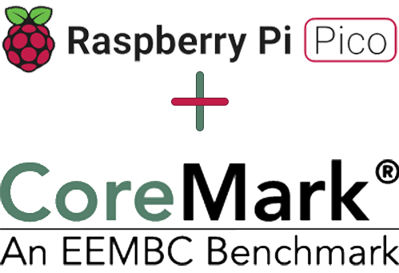

[Github](https://github.com/protik09/CoreMark-RP2040) 



This is the [COREMARK®](https://github.com/eembc/coremark) embedded benchmark ported for the [RP2040](https://github.com/raspberrypi/pico-sdk) chip from the folks over at Raspberry Pi.

#### 单核跑分

##### 使用方法：

使用串口工具发送任意字符，以启动跑分测试。

##### 测试结果：

```
CoreMark Performance Benchmark

CoreMark measures how quickly your processor can manage linked

lists, compute matrix multiply, and execute state machine code.

Iterations/Sec is the main benchmark result, higher numbers are better.

Press any key to continue.... 


Running.... (usually requires 12 to 20 seconds)

2K performance run parameters for coremark.
CoreMark Size    : 666
Total ticks      : 12718341
Total time (secs): 12.718341
Iterations/Sec   : 235.879821
Iterations       : 3000
Compiler version : GCC10.3.1 20210824 (release)
Compiler flags   : og
Memory location  : STACK
seedcrc          : 0xe9f5
[0]crclist       : 0xe714
[0]crcmatrix     : 0x1fd7
[0]crcstate      : 0x8e3a
[0]crcfinal      : 0xcc42
Correct operation validated. See README.md for run and reporting rules.
CoreMark 1.0 : 235.879821 / GCC10.3.1 20210824 (release) og / STACK


Program Ended
```

