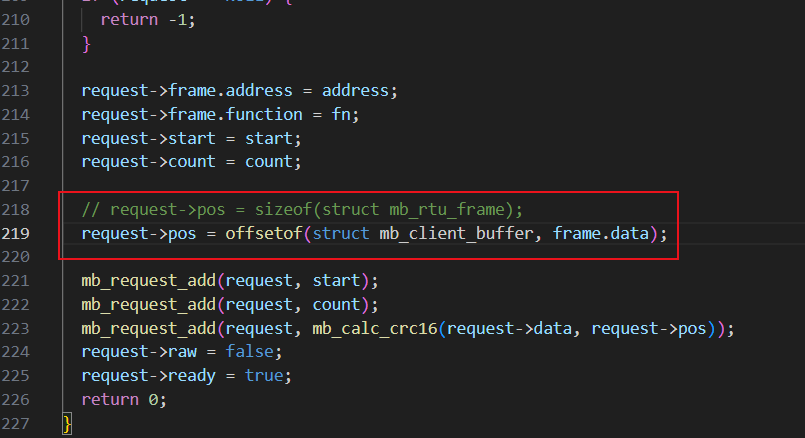

#### [Loadbalancer for controlling EV chargers over RS485 with P1 data](https://oshwlab.com/timstegeman/p1_modbus_loadbalancer) 

原工程中 [p1_abb_tac_modbus_adapter_rp2040](https://github.com/timstegeman/p1_abb_tac_modbus_adapter_rp2040) 的 `modbus_client.c` 中的函数有误（在原工程中没有使用），现已修正。（该程序中包含了：USB 虚拟双串口，串口命令行，modbus 主站和从站 ）

```c
int mb_client_read_write(struct mb_client_context* ctx, uint8_t address, uint8_t fn, uint16_t start, uint16_t count)
```



