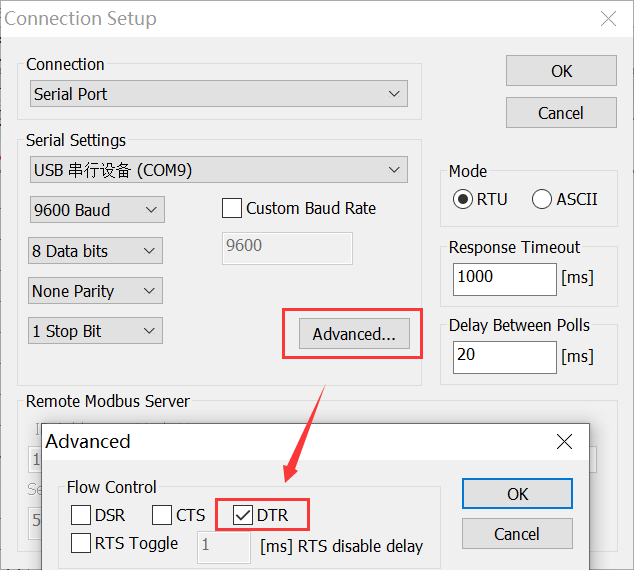
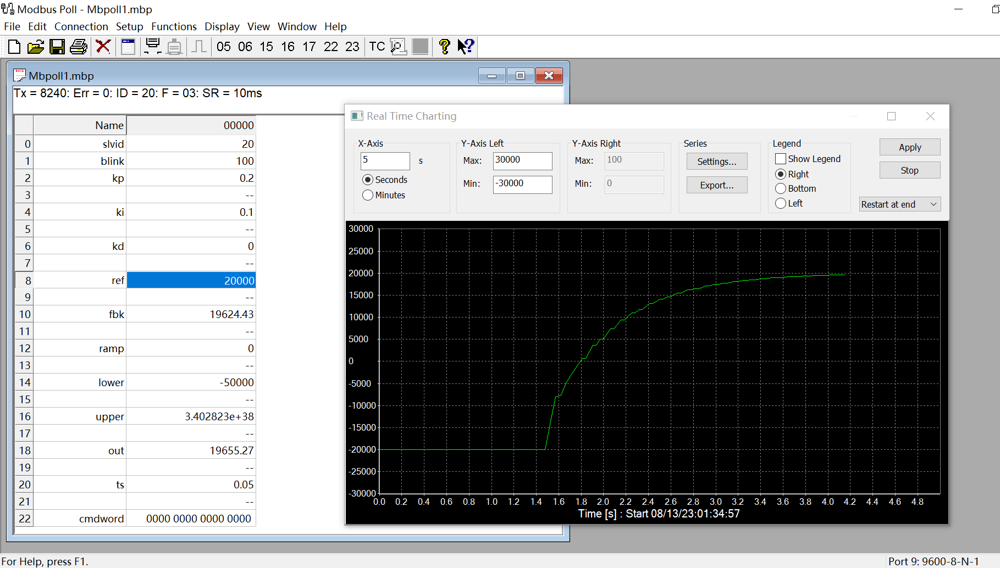
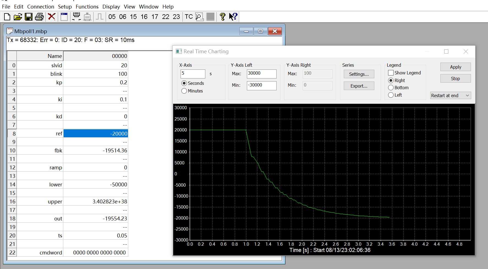
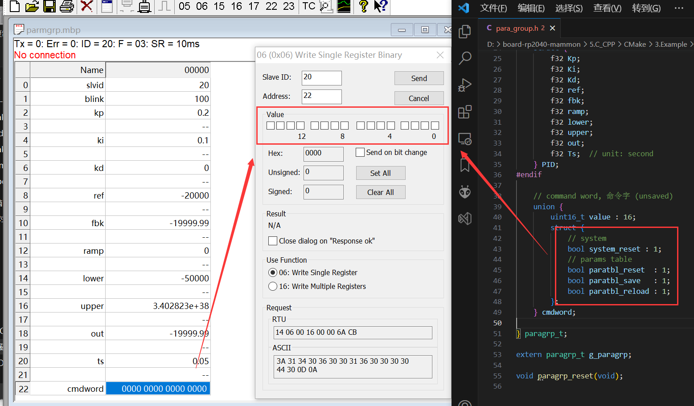
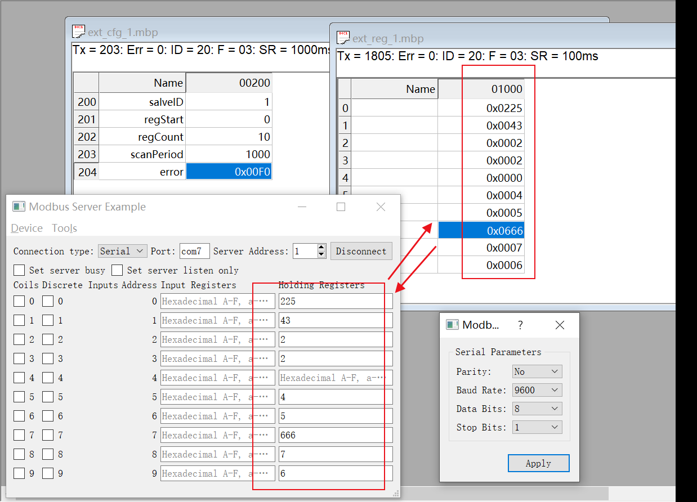
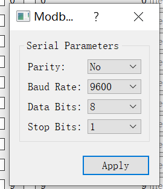
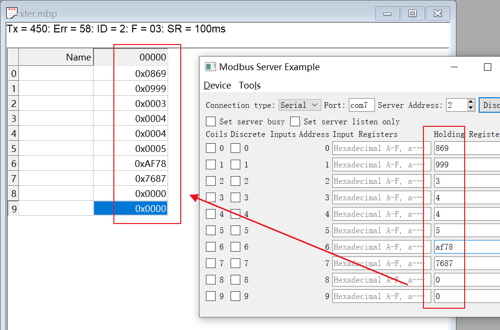
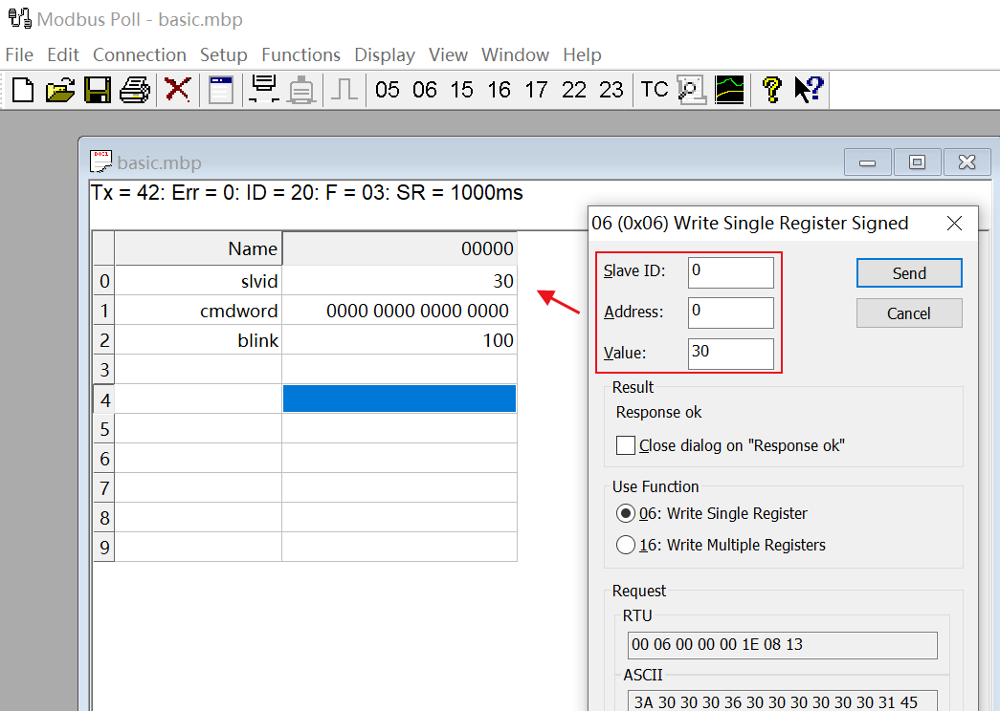
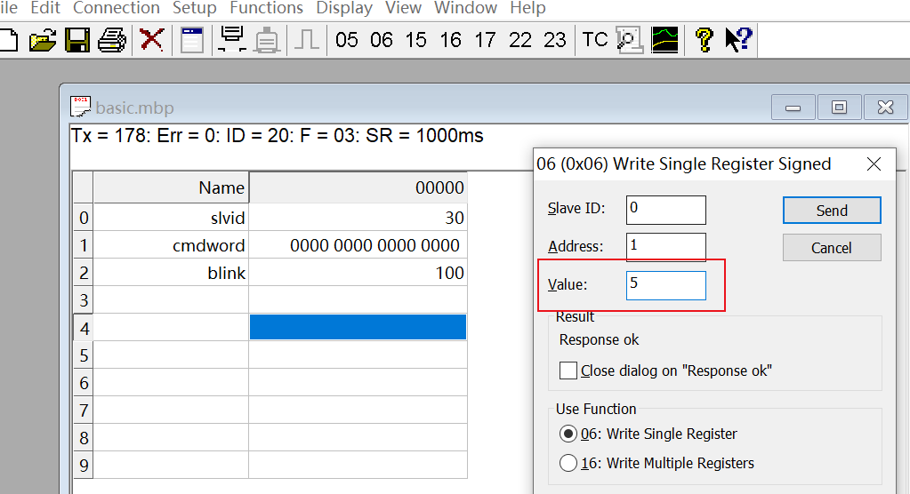

程序会通过 usb 虚拟出两个串口。

一个作为 modbus 的从站通信口，一个作为 printf 等调试输入输出口（可用于配置串口命令行）。

**连接设备**：串口参数任意，但 `DTR` 必须勾选。

**闪灯测试**：LED 电平翻转时间间隔 blink。

**PID 测试**：修改期望值 ref，将输出值 out 绑定到图表，进行实时显示。

- 幅度限制：lower，upper
- 斜率限制：ramp
- 计算间隔：每隔 ts （单位 s） 时间更新1次 PID输出

**控制字**

修改相应的比特位，触发相应命令。

如修改 modbus 的从机地址后，往 bit0,bit2 写1，系统保存参数表到 flash 里，然后芯片复位。

在从 flash 加载数据到参数表，即完成 modbus 的从机地址切换。（注：此时的 mbpoll 需重新连接）

#### 数据映射

（需启用 `CONFIG_EXT_MODULE`）

Pico 周期性读取接在串口（GP8、GP9）上的从站内的寄存器到内存中，mbpoll 周期性读取 Pico 的内存。

注：`ext_cfg_x.mbp`、`ext_reg_x.mbp` 的 `x` 指的是 第几组映射。通过在程序中的宏定义 `EXT_MODULE_COUNT` 配置组数。

这里使用了 QT 例程中 modbus 从站，且上位机串口配置如下：

#### 透明转发

（需禁用 `CONFIG_EXT_MODULE`）

从 usb 口接收到的帧不是 Pico 的帧时，通过串口（GP8、GP9 ）进行传输接收到的原始数据转发出去。

将从串口接收到的帧从 usb 口发出去。

#### 忘记设备地址了？

使用广播帧 `0` 进行地址设置从机地址。

触发保存（bit2）和设备重启（bit0）。

