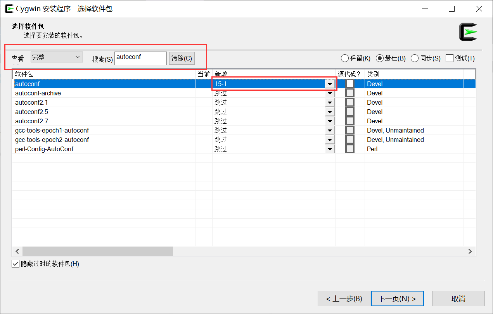

## verilator

### [window](https://blog.csdn.net/AS7062031/article/details/125985993) 

[Cygwin](https://www.cygwin.com/)：

#### 库



1. autoconf
2. make
3. perl
4. python3
5. gcc-core 
6. gcc-g++
7. flex
8. bison
9. wget
10. git

##### 编译

```bash
$ cd yours/verilator
$ autoconf
$ ./configure
$ make
$ make install
```

编译结果在 `bin` 文件夹中。

### linux

```bash
$ sudo su

# install arm-linux-gcc compiler
$ apt-get install build-essential

# install grammar and lexical analyzer
$ apt-get install bison flex 

# others
$ apt-get help2man

# compiler verilator
$ cd yours/verilator
$ autoconf
$ ./configure
$ make
$ make install
```

## FakePGA

---

注：本人并没编译成功。报错缺少 `mutex`，推测是 `gcc-arm-none-eabi` 缺少 `pthread` 导致。

---

把 `CMakelist.txt` 中的  `set(libVerilator "/usr/share/verilator/include")` 改为自己 `verilator` 所在路径。

### linux

```shell
# install pico toolcahin
$ sudo apt install cmake gcc-arm-none-eabi libnewlib-arm-none-eabi libstdc++-arm-none-eabi-newlib
$ git clone https://github.com/raspberrypi/pico-sdk.git
$ export PICO_SDK_PATH=yours/pico-sdk

# compiler project
$ cd yours/FakePGA
$ ./preBuild.sh
$ cmake ..
$ make
```

