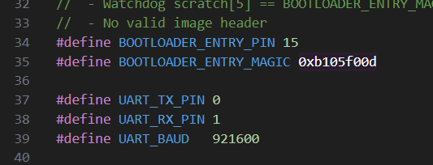

## 程序说明

### Pico

##### bootloader

上电进入 bootloader 的条件：

* application 不存在
* `BOOTLOADER_ENTRY_PIN` 被拉低（默认 GP15）

烧录接口：TX = 0，RX = 1，baud = 921600



##### application

需先引入 `noboot2.ld` ，再进行编译，以产生地址偏移。

```
pico_set_linker_script(${PROJECT_NAME} ${CMAKE_CURRENT_SOURCE_DIR}/noboot2.ld)
```

#### PicoW

（我的卡在 `cyw43_ll_bus_init` 中 ，没有运行成功）

OTA：Over-the-Air Technology，空中下载技术，通过网络/蓝牙等无线通信方式升级程序。

在 cmake 中添加：

```cmake
set(PICO_BOARD pico_w)
set(PICOWOTA_WIFI_AP 1)
set(PICOWOTA_WIFI_SSID uYanki)
set(PICOWOTA_WIFI_PASS 12345678)
```

或构建 cmake 时设置相关宏定义：

```shell
mkdir build
cd build
cmake  ..  -G "MinGW Makefiles" -DPICO_BOARD=pico_w -DPICOWOTA_WIFI_SSID=uYanki -DPICOWOTA_WIFI_PASS=12345678
make -j 8
```

烧录使用 golang 的 tcp 模式烧录。

## 烧录工具

### python

#### 安装库

```shell
$ pip install -r requirements.txt

pyelftools==0.29
pyserial==3.5
```

#### 烧录程序

* windows

```bash
python main.py COM11 blink.elf
```

```shell
serial-flash tcp:192.168.1.123 blink.elf
```

* linux

```shell
python3 main.py /dev/ttyUSB0 /home/build/blink.elf
```

### [golang](https://go.dev/doc/install)

#### 编译烧录工具

设置代理

```shell
go env -w GOPROXY=https://goproxy.cn,direct
```

下载项目依赖包

```shell
go mod init
```

编译程序

```shell
go get -v .
go build .
```

#### 烧录程序

* windows

```
serial-flash COM11 blink.elf
```

* linux

```
serial-flash /dev/ttyUSB0 blink.elf
```

