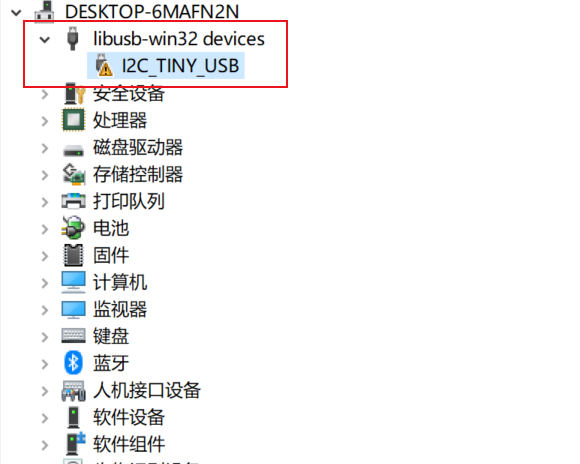
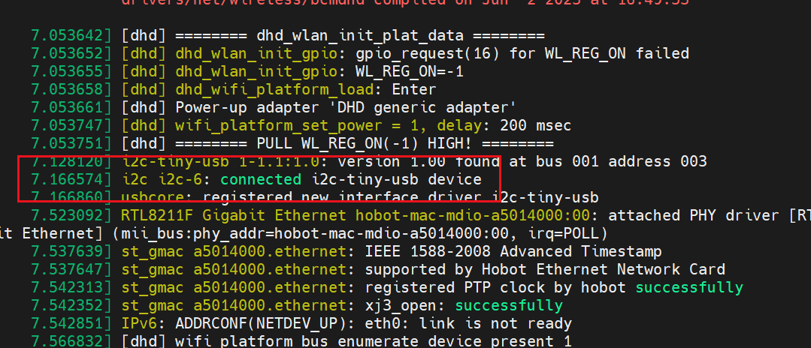

# [USB2I2C](https://hub.nuaa.cf/Nicolai-Electronics/rp2040-i2c-interface) 

**注：仅适配 Linux 系统！！**

烧录固件然后复位，在设备管理器会出现未知设备，右键选择本地文件更新[驱动](https://hub.nuaa.cf/harbaum/I2C-Tiny-USB/tree/master/win)程序，更新完成后如下所示，Windows  仍然不识别。VMware 是不连接 Windows 识别不到的设备的，即 VMware 也不能用。



---

个人使用的是 Linux 开发板进行测试

* 提权

```shell
$ sudo su
```

* copy rules

copy `99-pico.rules` into `/etc/udev/rules.d/`。

```bash
cp ./99-pico.rules /etc/udev/rules.d/
```

如提示没有权限，可安装并调用 `nautilus` ，打开高权限的文件管理器，再将 `99-pico.rules` 复制到 `/etc/udev/rules.d/` 即可。

```shell
$ pip install nautilus
$ nautilus
```

* get i2c id：

① Method 1

```bash
# list i2c device when pico not inserted
$ ls /dev/*i2c*
/dev/i2c-0  /dev/i2c-1

# list i2c device when pico inserted
$ ls /dev/*i2c*
/dev/i2c-0  /dev/i2c-1  /dev/i2c-6
# so usb2i2c's i2c number is 6

# scan i2c address
$ i2cdetect -r -y 6
     0  1  2  3  4  5  6  7  8  9  a  b  c  d  e  f
00:          -- -- -- -- -- -- -- -- -- -- -- -- --
10: -- -- -- -- -- -- -- -- -- -- -- -- -- -- -- --
20: -- -- -- -- -- -- -- -- -- -- -- -- -- -- -- --
30: -- -- -- -- -- -- -- -- -- -- -- -- 3c -- -- --
40: -- -- -- -- -- -- -- -- -- -- -- -- -- -- -- --
50: -- -- -- -- -- -- -- -- -- -- -- -- -- -- -- --
60: -- -- -- -- -- -- -- -- -- -- -- -- -- -- -- --
70: -- -- -- -- -- -- -- --

# NOTE: ssd1306 i2c address = 0x3c
```

② Method 2

```bash
$ dmesg
```



* run demo

```bash
# install smbus
$ pip install smbus

# run demo
$ python3 ssd1306.py
```

