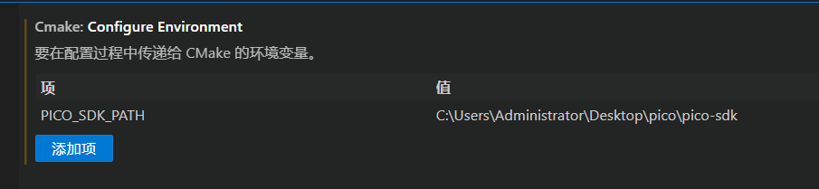
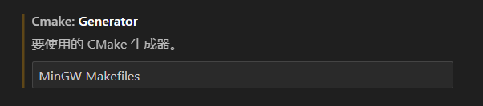
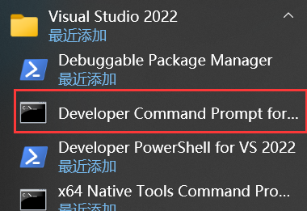
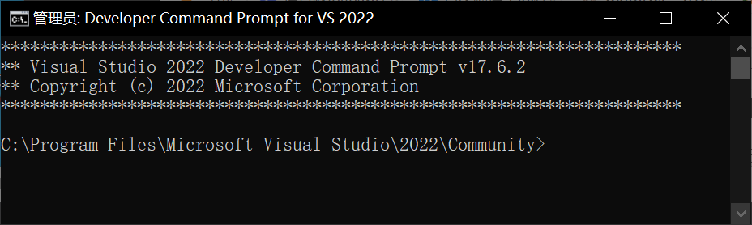
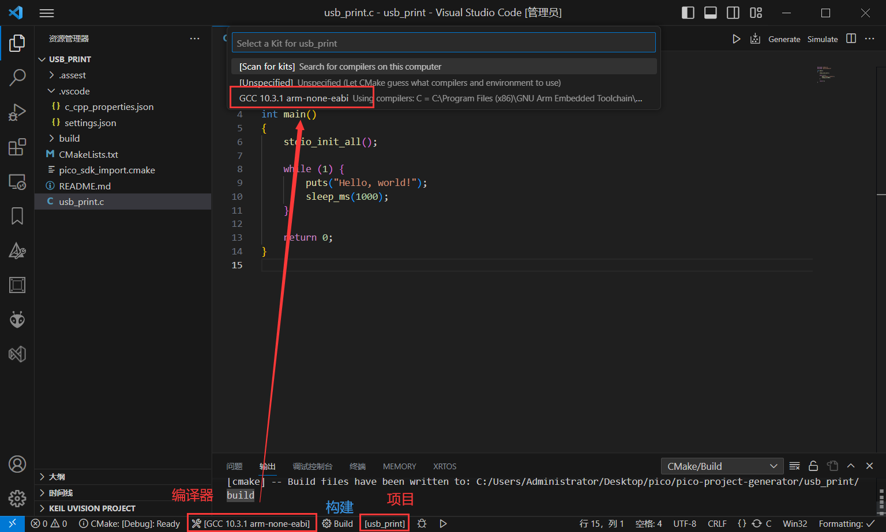
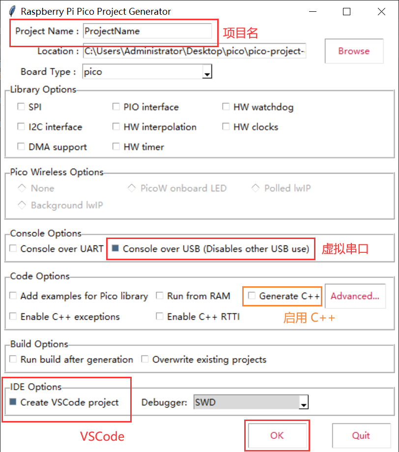
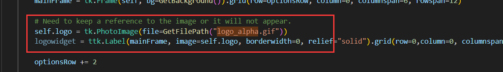
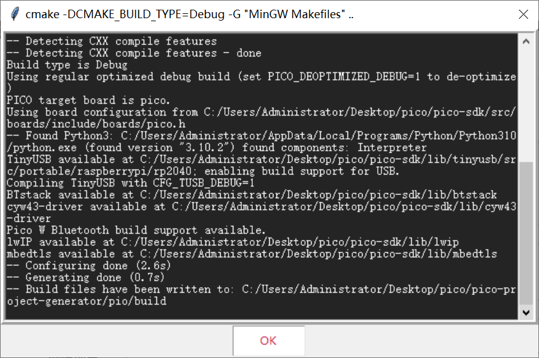
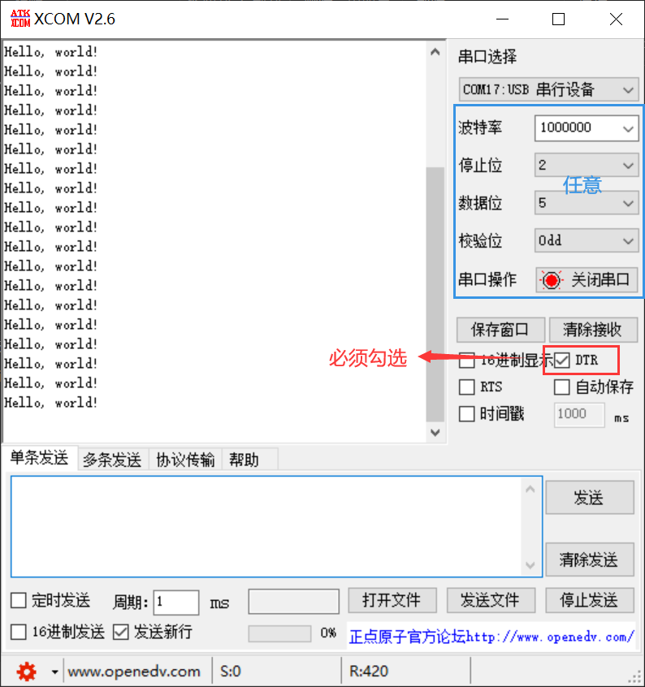

Pico Wiki

[1.环境搭建](https://pico.wiki/index.php/2021/01/27/pico-c-c-windows-lesson1.html) 

[2.创建工程](https://pico.wiki/index.php/2021/01/27/pico-c-c-windows-lesson2.html) 

CSDN

[环境搭建](https://blog.csdn.net/always_one/article/details/128193686) 

#### 环境搭建

全部安装最新版本。

##### ① [arm gcc compiler](https://developer.arm.com/tools-and-software/open-source-software/developer-tools/gnu-toolchain/gnu-rm/downloads) 

##### ② [python](https://www.python.org/downloads/) 

勾选环境变量，解除长路径限制。

```shell
mk1ink python3.exe python.exe
```

##### ③ [Cmake](https://cmake.org/download/) 

添加环境变量 for all users。

##### ④ Compiler

二选一，个人用 VSCode，选用 MinGW。

##### - [Visual Studio](https://visualstudio.microsoft.com/zh-hans/downloads/) （NMake）

C++ 桌面开发（默认）

1. MSVC
2. Windows 10 SDK(10.0.18362.0)
3. C++ Cmake tool for windows
4. Testing tool core features -Build Tools
5. C++ AddressSanitizer(Experimental)

##### - [MinGW](https://sourceforge.net/projects/mingw-w64/files/) 

往下拉，找到 x86_64-win32-seh，下载解压。

将 bin 文件夹（我的是 C:\mingw64\bin）添加至环境变量 path 中。

##### ⑤ [Git](https://git-scm.com/download/win) 

**下载仓库**

gitbash：

```shell
git clone -b master https://github.com/raspberrypi/pico-sdk.git
git clone -b master https://github.com/raspberrypi/pico-examples.git
cd pico-sdk
git submodule update --init --recursive
```

本仓库的 examples 是官方在 2023.06.11 下载的。 

**配置环境变量**

powershell：

```shell
setx PICO_SDK_PATH "[path]\pico-sdk"
```

⑥ [Visual Studio Code](https://visualstudio.microsoft.com/zh-hans/downloads/) 

安装 CMake 插件，`Ctrl+,` 或 按F1输入 `open settings UI` 来打开配置界面。

* cmake.configureEnvironment

添加 SDK 路径（根据自己的来改）

```
PICO_SDK_PATH = C:\Users\Administrator\Desktop\pico\pico-sdk
```



* cmake.generator = NMake Makefiles、MinGW Makefiles（根据安装的 Compiler 来选）



#### 编译例程

##### ① Visual Studio

打开 Visual Studio 的命令行工具 Developer Command Prompt：

[]() []()

进入 examples 文件夹

```shell
cd "[path]\pico-examples"
```

更新 makefile（在 build 目录里，取上层目录的 cmakelist.txt，生成 NMake 对应的 makefile）

```shell
mkdir build
cd build
cmake .. -G "NMake Makefiles" 
```

在 pico-examples/build 目录下，进入例程并编译

```sh
cd blink
nmake
```

烧录程序（芯片需提前进入烧录模式）：

* .uf2：右键上传到 RPI-RP2 中。

```shell
cp ./main.uf2 F:/
```

* .elf：通过 SWD 烧录（若调试则需指定为 debug）
* .bin：直接烧录到 flash

##### ② MinGW

在 pico-examples 目录中打开命令行

```shell
mkdir build
cd build
cmake .. -G "MinGW Makefiles" 
cd blink
mingw32-make
```

注：如构建的时 PicoW，请使用如下指令，否则无法编译 wifi/ble 相关例程。

```shell
cmake  ..  -G "MinGW Makefiles" -DPICO_BOARD=pico_w
```

##### ③ VSCode



选择编译器，选择项目，构建

#### 创建项目

图形化工具

```python
git clone https://github.com/raspberrypi/pico-project-generator.git
python ./pico_project.py --gui
```



若窗口高度过高且屏幕较小，无法看到底下的项目生成按钮（OK），可屏蔽窗口中的图片横幅（上图是已屏蔽的了），在 `pico_project.py` 中将这两句给屏蔽即可。



生成 CMake 文件（创建完成后不会自动退出）。



使用 VSCode 打开项目即可，然后按编译例程的步骤走即可。

#### 虚拟串口

① 波特率等参数任意，但 `DTR` 必须勾选，才会有数据输出。



② 使用 `MobaXterm`  

```c
#include <stdio.h>
#include "pico/stdlib.h"

int main()
{
    stdio_init_all();

    while (1) {
        puts("Hello, world!");
        sleep_ms(1000);
    }

    return 0;
}
```

#### 调试器

SWD（DAPLINK）/ Probe

