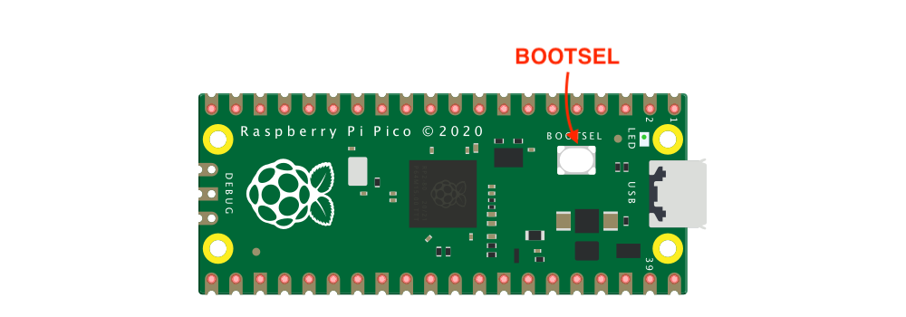
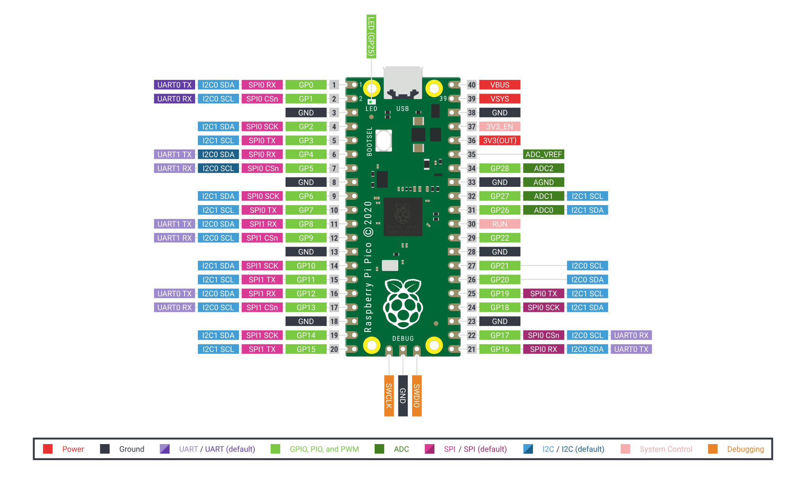
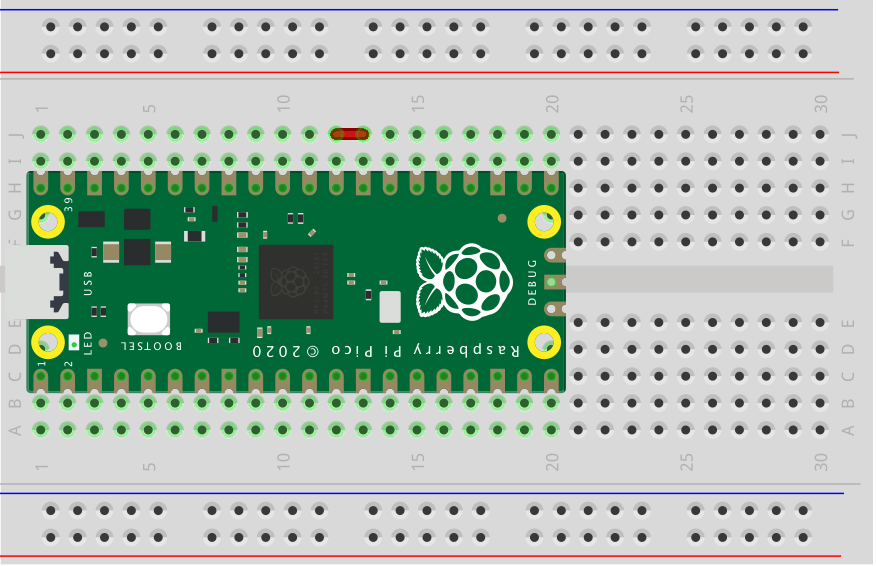

[TOC]

---

# Link

[kalumajs](https://kalumajs.org/) [fireware](https://kalumajs.org/download/) [docs](https://kalumajs.org/docs/getting-started) [examples](https://github.com/kaluma-project/examples) [packages](https://kalumajs.org/packages/) [case](https://kalumajs.org/showcase/) [github](https://github.com/kaluma-project) 

---

# Getting Started

In this article we will give you a quick tutorial to get start within 10 minutes.

## Get a Rasberry Pi Pico

Get a [Raspberry Pi Pico](https://www.raspberrypi.org/products/raspberry-pi-pico/) board or other RP2040 board.

## Install firmware



- [Download](https://kalumajs.org/download) firmware (**.UF2**).
- Push and hold the **BOOTSEL** button and plug into USB port of your computer, and then release the button. It will mount as USB storage device named **RPI-RP2**.
- Drag and drop the downloaded **.UF2** onto the **RPI-RP2** volume. Your Pico will reboot automatically.

## Install CLI (Command-Line Interface)

First of all, we have to install [Kaluma CLI](https://github.com/kaluma-project/kaluma-cli) in your local computer to work with boards Kaluma installed. Of course, it is assumed that [Node.js](https://nodejs.org/) is installed.

```bash
$ npm install -g @kaluma/cli
```

After installation you can see help message with `help` command.

```bash
$ kaluma help
```

## Connect with Terminal

Once you installed the firmware, you can use the board in [REPL](https://kalumajs.org/docs/repl) mode with any ANSI/VT100 compatible serial terminals. CLI provides a simple serial terminal feature with `shell` command:

```bash
$ kaluma shell

# you can specify a serial port
$ kaluma shell --port /dev/tty.usbmodem0000000000001

# to see all available serial ports
$ kaluma ports
```

Then you will see a welcome message and the prompt `>` (If you cannot see the prompt, press `Enter` several times). On the prompt you can enter any JavaScript expressions or [REPL commands](https://kalumajs.org/docs/repl). Type `.help` command, you will see all available REPL commands.

```plain
> .help
```

You can exit the CLI shell connection by pressing `ctrl+z`.

You can use other serial terminal programs including `screen` command in macOS and Linux, or [PuTTY](https://www.putty.org/) in Windows.

## Setup project

To create a project, simply make a directory.

```bash
$ mkdir kaluma-app
$ cd kaluma-app
```

We recommend to initialize the project with NPM to create `package.json`.

```bash
$ npm init -y
```

## Write your code

Let's write the first blink code `index.js` in the project folder with any text editor (VSCode, Atom, Sublime Text, etc).

```js
// index.js
const led = 25;
pinMode(led, OUTPUT);
setInterval(() => {
  digitalToggle(led);
}, 1000);
```

## Flash your code

Use CLI to flash `index.js` to your board.

```bash
$ kaluma flash index.js
```

After uploading successfully, you will see a blinking LED on the board.

## Install third-party packages

You can install third-party packages with NPM. You can find third-party packages for Kaluma in [Packages](https://kalumajs.org/packages).

```bash
$ npm install https://github.com/niklauslee/dht --save
```

Then you can import the package with `require()`.

```js
const { DHT } = require('dht');
```

## Bundle multiple files

Please remember that only a single `.js` file can be flashed in Kaluma. If you are using multiple `.js` files or using third-party modules installed by `npm install`, you have to bundle them into the a single `.js` file.

```bash
$ kaluma bundle ./index.js
```

You can find `bundle.js` file and flash the bundled code.

```bash
$ kaluma flash ./bundle.js
```

Or shorty, you can bundle and flash at once with `--bundle` option.

```bash
$ kaluma flash ./index.js --bundle
```

## Debug

To check the errors raised during the code execution, you need to connect with serial terminal again. However CLI's `flash` command will load the code automatically so you can't see the error messages. So you have to use `--shell` option to flash code with shell connection.

```bash
$ kaluma flash ./index.js --bundle --shell
```

Then you can see all console logs and errors because shell connection still alive even after flashing code. Hit `ctrl+z` to quit.

Sometimes the flashed code can crash the board. Because Kaluma automatically execute the code in flash on boot, you have no way to recover the board in software manner. In this case you can skip code loading on boot by wiring `GP22` pin and `GND` pin (See [Skip code loading on boot](https://kalumajs.org/docs/boards/pico/#skip-code-loading-on-boot)). Then you can connect with terminal and you can erase the code from the internal flash in REPL mode.

```plain
> .flash -e
```

# REPL

Kaluma provides REPL (Read-Eval-Print-Loop) mode that can be used by connecting with any ANSI/VT100 serial terminal programs.

## Using CLI

If you installed [Kaluma CLI](https://github.com/kaluma-project/kaluma-cli), you can connect with CLI's `shell` command.

```bash
$ kaluma shell

# or specify a serial port
$ kaluma shell --port /dev/tty.usbmodem0000000000001

# to see all available serial ports
$ kaluma ports
```

## Using External Terminal Programs

In MacOS or Linux you can simply connect with `screen` command (Use other serial terminals in Windows like [PuTTY](https://www.putty.org/)).

```bash
# for MacOS
$ screen /dev/tty.usbmodem.. 115200

# or for Linux
$ sudo screen /dev/ttyACM.. 115200
```

When successfully connected you can see the prompt `>` (If you cannot see the prompt, press `Enter` several times).

On the prompt you can enter any JavaScript expressions or REPL commands. Type `.hi` command, you will see a welcome message.

```bash
> .hi
```

To exit the screen terminal, press `ctrl+a`, `k`, `y`.

## REPL Commands

All REPL commands are started with `.` to be distinguished from JavaScript expression. Type `.help` to see all available commands.

```plain
> .help
```

### Default commands

- `.echo [on|off]` : Echo on/off.

- `.reset` : Reset JavaScript runtime context.

- `.mem` : Print heap memory usage information (total available, used and peak).

- `.gc` : Enforce garbage collection.

- ```text
  .flash
  ```

   [options] : Read or write data to the non-versatile flash memory.

  - option `-w` : Write user code to flash via YMODEM.
  - option `-e` : Erase the user code in flash.
  - option `-t` : Get total size of flash for user code.
  - option `-s` : Get size of user code.
  - option `-r` : Print user code in textual format.

- `.load` : Load and run Javascript program stored in flash memory.

- `.hi` : Print welcome message.

- `.help` : Print all available commands.

### File system commands

- `.ls` : List files.
- `.pwd` : Print current directory.
- `.cd` : Change current directory.
- `.mkdir` : Create directory.
- `.rm` : Remove file or directory.
- `.cat` : Print the content of file.

## Special Keys

- `<ctrl>+C` To break the execution of your code.
- `<ctrl>+D` Soft reset.
- `<up>` and `<down>` Navigates in the input history.

# Tutorials

## Physical Computing with JavaScript

[English](https://niklauslee.medium.com/physical-computing-with-javascript-table-of-contents-69c38fd74e61) | [Korean](https://niklauslee.medium.com/자바스크립트-javascript-로-배우는-피지컬-컴퓨팅-physical-computing-목차-8faffb5ca20b)

1. [Let’s Get Started](https://niklauslee.medium.com/physical-computing-with-javascript-1-8-lets-get-started-642a9954adb2)
2. [Blinking LED](https://niklauslee.medium.com/physical-computing-with-javascript-2-8-blinking-led-37544b14e964)
3. [Reading State of Switch](https://niklauslee.medium.com/physical-computing-with-javascript-3-8-reading-state-of-switch-106137a2f9d6)
4. [LED Dimming](https://niklauslee.medium.com/physical-computing-with-javascript-4-8-led-dimming-403696103d2f)
5. [Sensing Temperature and Humidity](https://niklauslee.medium.com/physical-computing-with-javascript-5-8-sensing-temperature-and-humidity-2040eb1d20e9)
6. [Showing Temperature on 7-Segment Display](https://niklauslee.medium.com/physical-computing-with-javascript-6-8-showing-temperature-on-7-segment-display-b670f11fa36e)
7. [Using Graphic Display](https://niklauslee.medium.com/physical-computing-with-javascript-7-8-using-graphic-display-fc57580fc37)
8. [Connecting to Internet](https://niklauslee.medium.com/physical-computing-with-javascript-8-8-connecting-to-internet-151ba3dfce59)

# Raspberry Pi Pico

This page describes information about the Kaluma port for [Raspberry Pi Pico](https://www.raspberrypi.org/products/raspberry-pi-pico/).

## Pinout



## Upload firmware (.UF2)

You can upload Kaluma firmware to your Raspberry Pi Pico board by following steps.

1. Download Kaluma firmware `.UF2` file from https://kaluma.io/download.
2. Push and hold the `BOOTSEL` button and plug into USB port of your computer. Release the `BOOTSEL` button after connected. It will mount as as USB storage device named `RPI-RP2`.
3. Drag and drop the downloaded `.UF2` onto the `RPI-RP2` volume. Your Pico will reboot automatically.
4. Now Kaluma is running on your Pico.

## Skip code loading on boot

Sometimes you need to skip loading the code stored in the internal flash on boot. You can skip code loading by setting `GP22` to `GND`.



## Object: board

This section shows the Raspberry Pi Pico specific properties of the global [board](https://kalumajs.org/docs/api/board/) object.

### board.LED

- `<number>`

The GPIO number for the on-board LED.

- Pico-W does not have on-board LED which is controlled by RP2040. On-board LED on Pico-W can be controlled by pico_cyw43 module.

```javascript
console.log(board.LED); // 25 for pico and undefined for pico-w
```

## Flash

Pico has 2MB flash size. 1008KB are used for firmware binary and the rest (1040KB) are used for user (total 260 blocks, block size is 4KB). Here is the flash allocation map.

| Block   | Size  |                                                              |
| ------- | ----- | ------------------------------------------------------------ |
| 0~3     | 16KB  | [Storage](https://kalumajs.org/docs/api/storage) (Key-Value) |
| 4~131   | 512KB | User Program                                                 |
| 132~259 | 512KB | [File System](https://kalumajs.org/docs/api/file-system) (LittleFS) |

## PWM

There are 16 PWM channels (8 2-channel slices). GPIO pins sharing a channel (e.g. GPIO 0 and GPIO16) cannot be used at the same time.

| GPIO | Channel | GPIO | Channel | GPIO | Channel |
| ---- | ------- | ---- | ------- | ---- | ------- |
| 0    | 0A      | 10   | 5A      | 20   | 2A      |
| 1    | 0B      | 11   | 5B      | 21   | 2B      |
| 2    | 1A      | 12   | 6A      | 22   | 3A      |
| 3    | 1B      | 13   | 6B      | 23   | 3B      |
| 4    | 2A      | 14   | 7A      | 24   | 4A      |
| 5    | 2B      | 15   | 7B      | 25   | 4B      |
| 6    | 3A      | 16   | 0A      | 26   | 5A      |
| 7    | 3B      | 17   | 0B      | 27   | 5B      |
| 8    | 4A      | 18   | 1A      | 28   | 6A      |
| 9    | 4B      | 19   | 1B      | 29   | 6B      |

## I2C

Default values for I2C functions.

| Function     | Default |
| ------------ | ------- |
| I2C baudrate | 400,000 |
| I2C0 SCL     | GPIO 4  |
| I2C0 SDA     | GPIO 5  |
| I2C1 SCL     | GPIO 2  |
| I2C1 SDA     | GPIO 3  |

## SPI

Default values for SPI functions.

| Function       | Default   |
| -------------- | --------- |
| SPI baudrate   | 1,000,000 |
| SPI0 SCK       | GPIO 18   |
| SPI0 MOSI (TX) | GPIO 19   |
| SPI0 MISO (RX) | GPIO 16   |
| SPI1 SCK       | GPIO 10   |
| SPI1 MOSI (TX) | GPIO 11   |
| SPI1 MISO (RX) | GPIO 12   |

## UART

Default values for UART functions.

| Function         | Default |
| ---------------- | ------- |
| UART baudrate    | 115,200 |
| UART buffer size | 2,048   |
| UART0 TX         | GPIO 0  |
| UART0 RX         | GPIO 1  |
| UART1 TX         | GPIO 8  |
| UART1 RX         | GPIO 9  |

## Storage

Capacity for [Storage](https://kalumajs.org/docs/api/storage) functions.

| Capacity                    | Value                             |
| --------------------------- | --------------------------------- |
| Max size of storage item    | 253 bytes (key size + value size) |
| Max number of storage items | 64                                |

# Raspberry Pi Pico W

This page describes information about the Kaluma port for [Raspberry Pi Pico W](https://www.raspberrypi.org/products/raspberry-pi-pico/).

> Note that this page describes only the differences from the Pico board. Please see the [Pico](https://kalumajs.org/docs/boards/pico) page for the information not covered here.

## Pinout


## On-board LED

Pico-W does not have on-board LED which is controlled by RP2040. Instead, the on-board LED can be controlled by [CYW43](https://kalumajs.org/docs/api/cyw43) module as below:

```js
const { PicoCYW43 } = require('pico_cyw43');
const pico_cyw43 = new PicoCYW43();

// Blink on-board LED
setInterval(() => {
  if (pico_cyw43.getGpio(0)) {
    pico_cyw43.putGpio(0, false); // turn-off LED
  } else {
    pico_cyw43.putGpio(0, true); // turn-on LED
  }
}, 1000);
```

## Modules

Supported modules more than Pico board:

- [CYW43](https://kalumajs.org/docs/api/cyw43)
- [Wi-Fi](https://kalumajs.org/docs/api/wifi)
- [Net](https://kalumajs.org/docs/api/net)
- [HTTP](https://kalumajs.org/docs/api/http)

### CYW43

Raspberry Pi Pico W has an on-board WiFi module using the Infineon CYW43439. Kamula support [CYW43](https://kalumajs.org/docs/api/cyw43) module as WiFi and network driver.