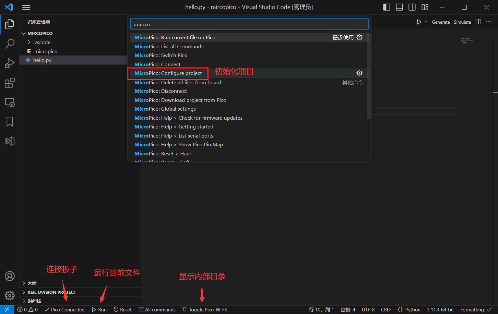

#### MicroPico VSCode [Extension](https://marketplace.visualstudio.com/items?itemName=paulober.pico-w-go) 



##### Requirements

* [MicroPython firmware](https://micropython.org/download) 

* [Python 3.9 or newer (with pip)](https://www.python.org/downloads/)

* [`pyserial` pip package](https://pypi.org/project/pyserial/) or `pip install pyserial`

##### Visual Studio Code extensions

* `ms-python.python` | [[Install\]](vscode://extension/ms-python.python) [[Show\]](https://marketplace.visualstudio.com/items?itemName=ms-python.python)

* `visualstudioexptteam.vscodeintellicode` | [[Install\]](vscode://extension/visualstudioexptteam.vscodeintellicode) [[Show\]](https://marketplace.visualstudio.com/items?itemName=VisualStudioExptTeam.vscodeintellicode)

* `ms-python.vscode-pylance` | [[Install\]](vscode://extension/ms-python.vscode-pylance) [[Show\]](https://marketplace.visualstudio.com/items?itemName=ms-python.vscode-pylance)

#### blink

```python
from machine import Pin
from time import sleep_ms

LED = Pin("LED", Pin.OUT)
# LED = Pin(25, Pin.OUT, Pin.PULL_UP)

while True:
    LED.toggle()
    sleep_ms(1000)
```

