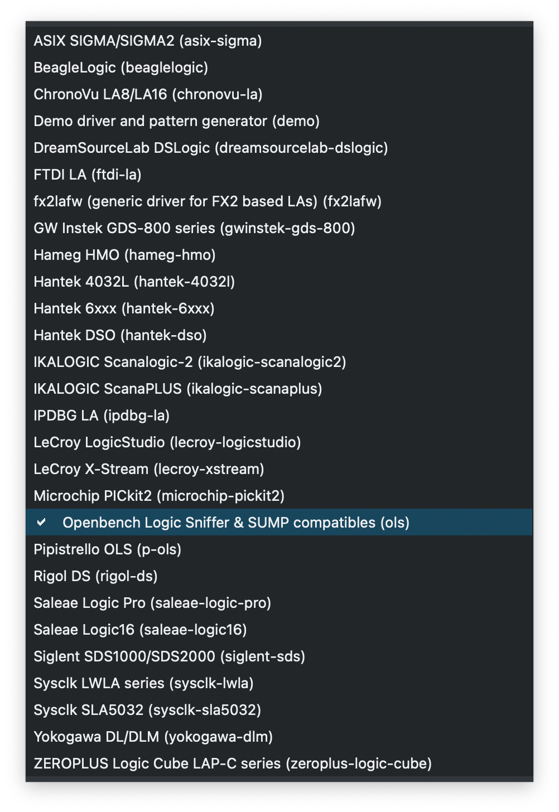
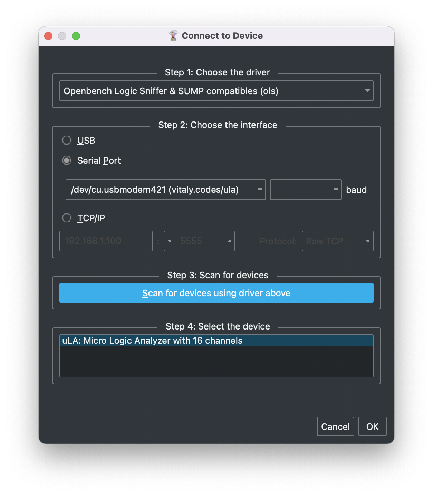
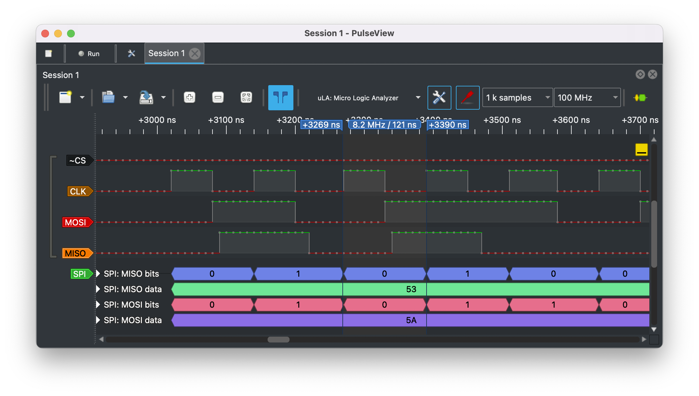
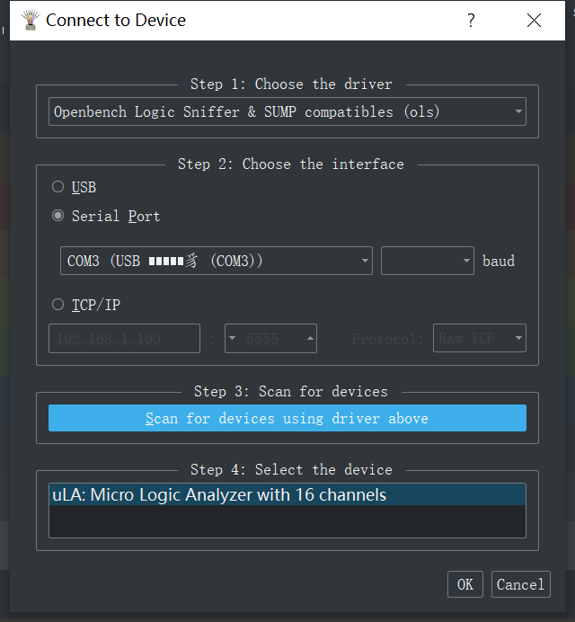

[sigrok](https://sigrok.org/wiki/Downloads#Binaries_and_distribution_packages) ，[ula](b.com/dotcypress/ula) 

#### 烧录

按照 Toochain 中的 README 安装 [Rustup](https://rustup.rs) 后：

```sh
# Install Cortex-M0, M0+, and M1 (ARMv6-M architecture) target
$ rustup target add thumbv6m-none-eabi

# Install LLVM tools
$ rustup component add llvm-tools-preview

# Install cargo-binutils
$ cargo install cargo-binutils

# Install elf2uf2
$ cargo install elf2uf2-rs

# Install flip-link
$ cargo install flip-link

# Hold the BOOTSEL button while connecting your board to the computer

# Compile and Flash microcontroller
$ cargo run --release
```

#### 连接 

PulseView：

* protocol ：Openbench Logic Sniffer & SUMP compatible
* interface：serial port

|                      Protocol selection                      |                       Connect window                       |
| :----------------------------------------------------------: | :--------------------------------------------------------: |
|  |  |

引脚 GP0~15 为该逻辑分析仪的通道。



---

#### 实测



使用的 pulseview - win10 版本 0.5.0，在下发采集命令的时候上位机容易卡死或者无法触发采集。

每次连接不上都要断电在重新上电。

