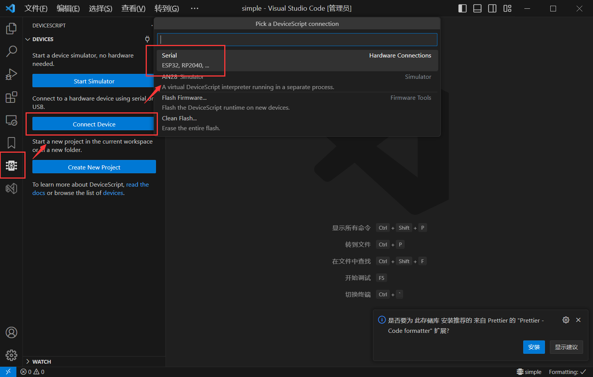
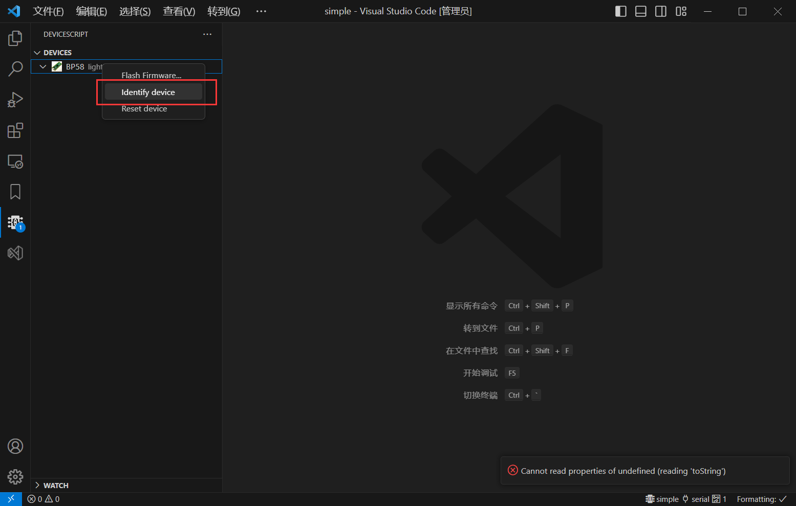
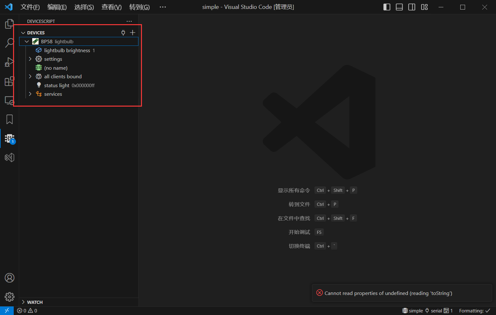
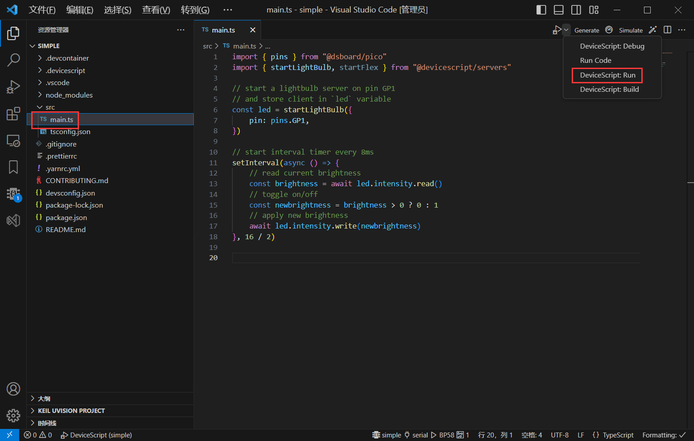

## Link

[Github Project](https://github.com/microsoft/devicescript-pico)  

[UF2 Fireware](https://github.com/microsoft/devicescript-pico/releases) 

[Development Docs](https://microsoft.github.io/devicescript/intro) 

[VSCode  Extension](https://marketplace.visualstudio.com/items?itemName=devicescript.devicescript-vscode)

[Node.JS 16+](https://nodejs.org/en/download/)

---

## USE

##### 连接设备

##### 运行程序

效率较低，电平翻转周期在 20ms (50Hz) 时波形还算正常，16 ms 就不行了。

