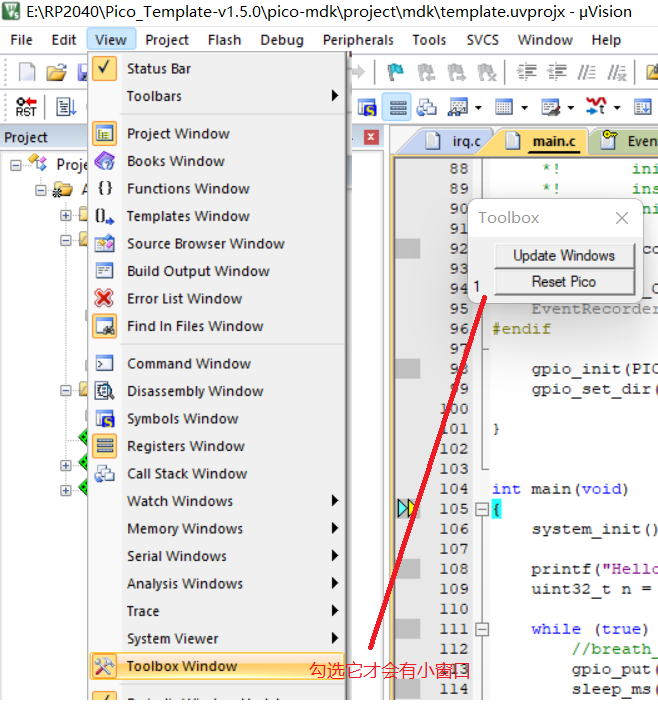

https://www.armbbs.cn/forum.php?mod=viewthread&tid=110878&extra=page%3D1

[【独家】我就要用MDK来开发树莓Pico，怎么地吧！ (qq.com)](https://mp.weixin.qq.com/s?__biz=MzAxMzc2ODMzNg==&mid=2656103324&idx=1&sn=f1d3ece87c81eeaa7d402f3cba60dc8f&chksm=8039c863b74e4175edc806b4e329c25e75b6372df53f07565bd9a46cfbf13a3c4cd9e20c08cc&scene=21#wechat_redirect)
[MDK震惊！树莓派Pico的调试还能“单体自助”的？ (qq.com)](https://mp.weixin.qq.com/s?__biz=MzAxMzc2ODMzNg==&mid=2656103369&idx=1&sn=071f491db464067feba27b2dc3a61235&chksm=8039c836b74e4120a2ab38da43ef4e8023bcbe5f28120c7122b18a7ef3eb8c49848f5966f36c&scene=178&cur_album_id=2040330776910626817#rd)

[【更新】Pico-Template 稳定调试版v1.3.2发布 (qq.com)](https://mp.weixin.qq.com/s?__biz=MzAxMzc2ODMzNg==&mid=2656103400&idx=1&sn=c8849ef6a6842281f326ea55660cf64b&chksm=8039c817b74e4101755e7870f945267822fd8477c30150741f3bb0150899d1f3fc454c299463&scene=178&cur_album_id=2040330776910626817#rd)

下载他的模板，可以在KEIL MDK下编译，下载调试.

最新版本下载:
https://github.com/GorgonMeducer/perf_counter/releases

支持DAP调试的第3方固件(需要拖放到RP2040)
https://github.com/majbthrd/pico-debug/releases

MDK工程中有4个配置. 带debug可以跟踪单步调试
AC6-flash  （生成的 template.uf2 文件拖入RPI-RP2磁盘）
AC6-RunInSRAM
AC6-DebugInSRAM
AC6-DebugInSRAM-printf

注意事项：不能使用MDK中的reset按钮，需要使用弹出的小窗口中的复位功能(Reset Pico), 否则需要按住BOOTSEL重新拖放DAP固件.
小窗口不可见的话，勾选MDK中的 View - Toolbox Window

----

