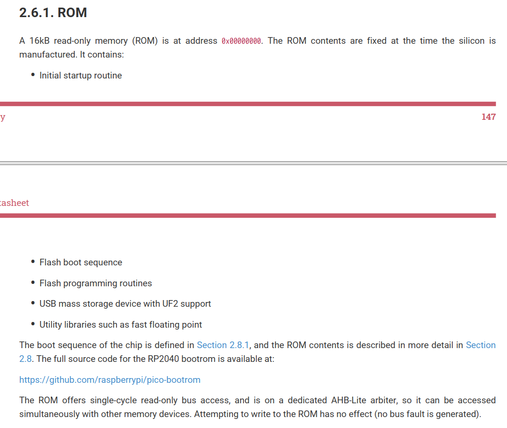
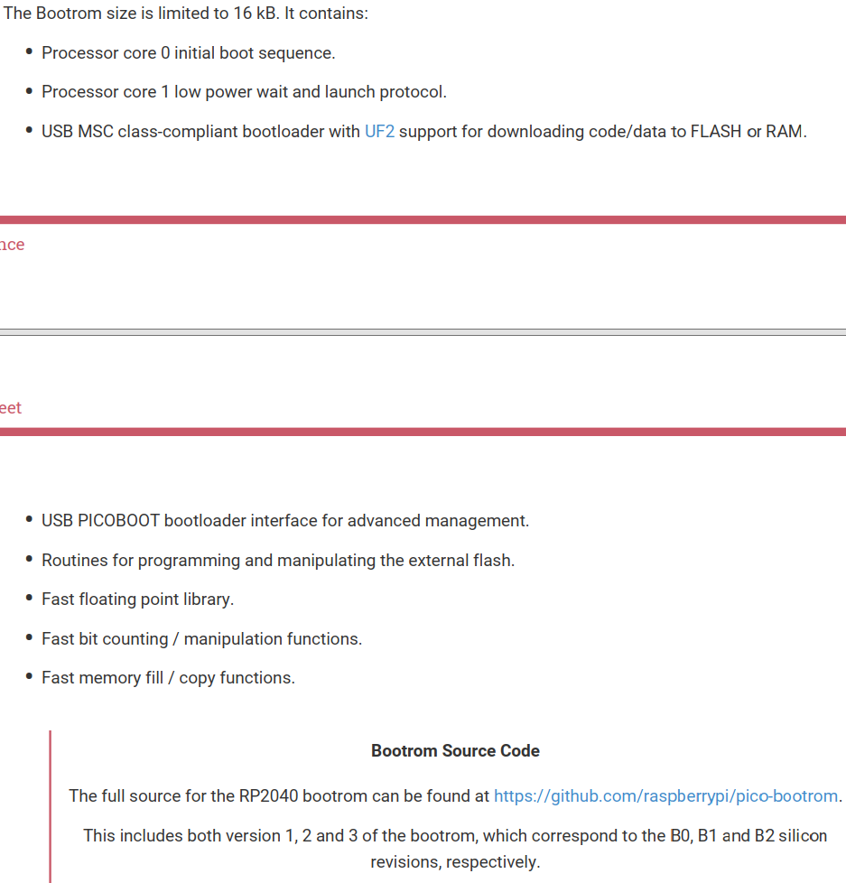

https://www.armbbs.cn/forum.php?mod=viewthread&tid=111774&extra=page%3D2

这部分代码不需要大家去读，树莓派全部开源出来了。

芯片的16KB ROM空间里面直接做了固化。

[raspberrypi/pico-bootrom (github.com)](https://github.com/raspberrypi/pico-bootrom)

