[Developing Raspberry Pi Pico Projects with Visual Studio – VisualGDB Tutorials](https://visualgdb.com/tutorials/raspberry/pico/)  

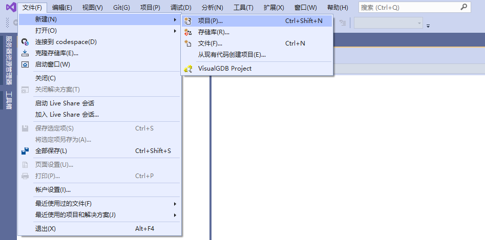 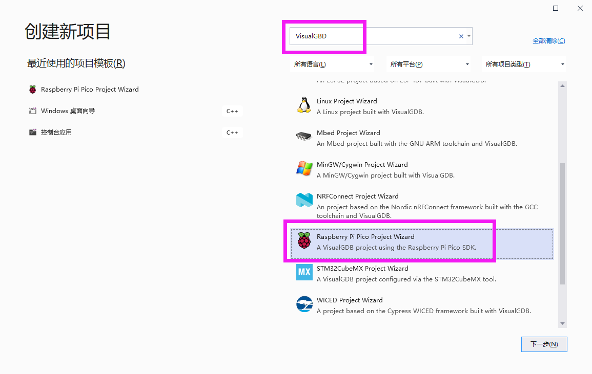  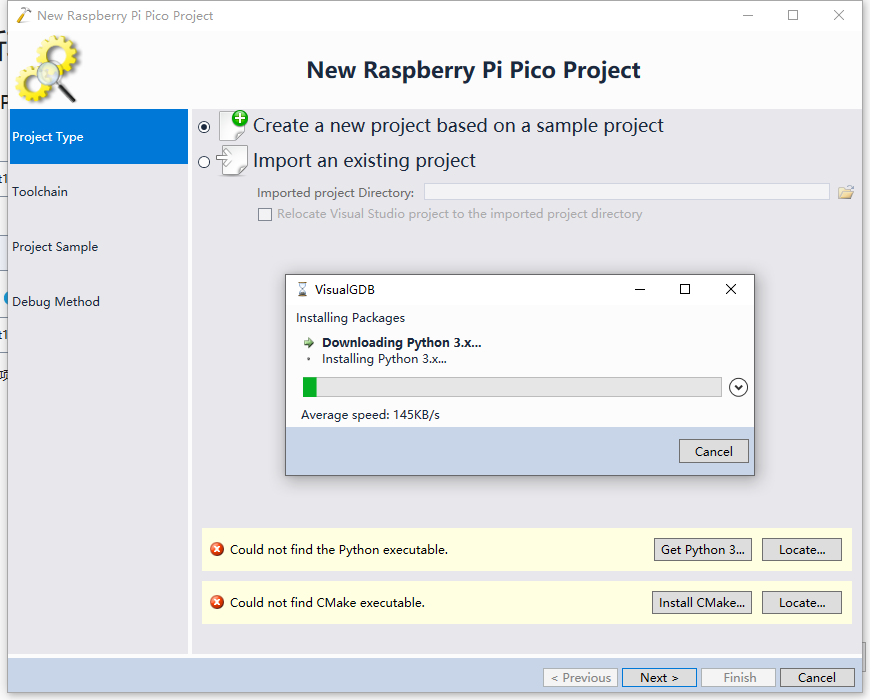 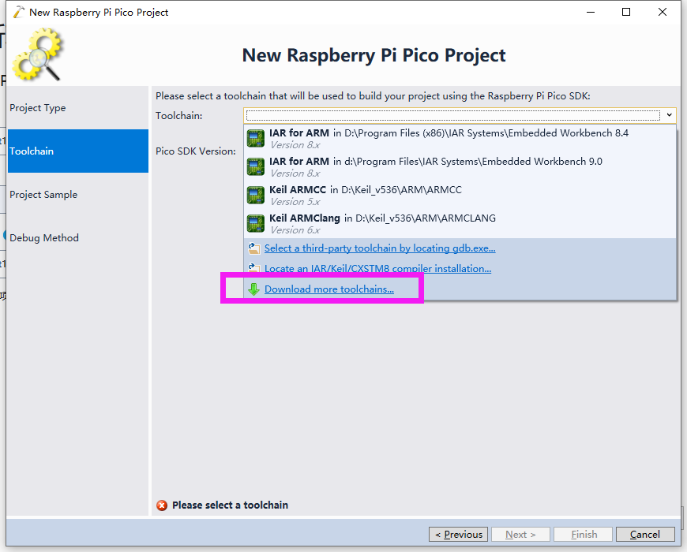  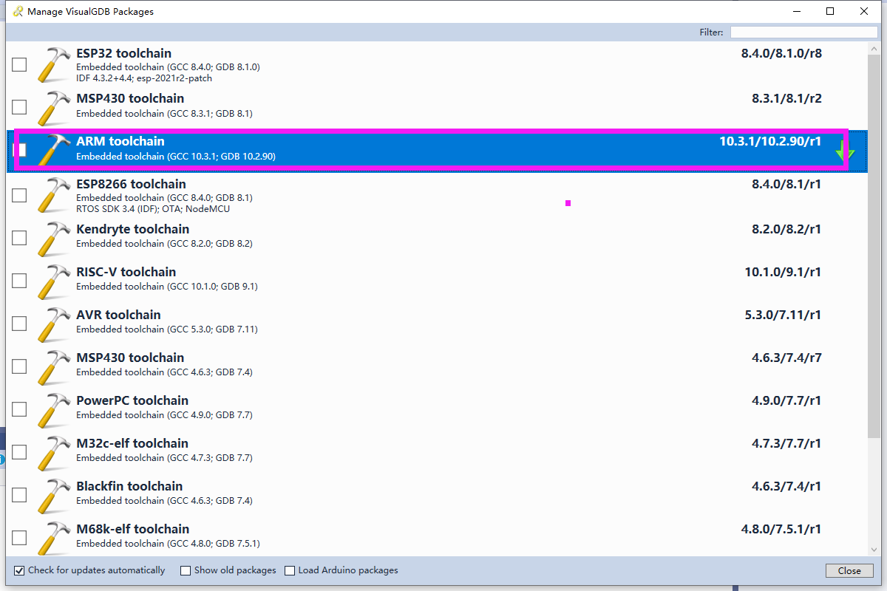  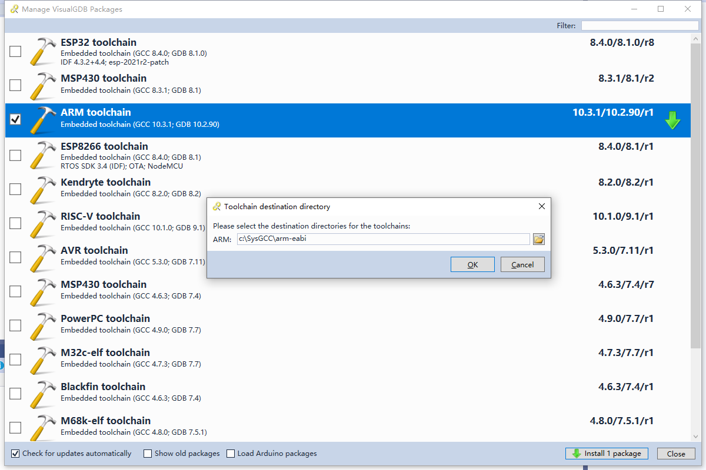  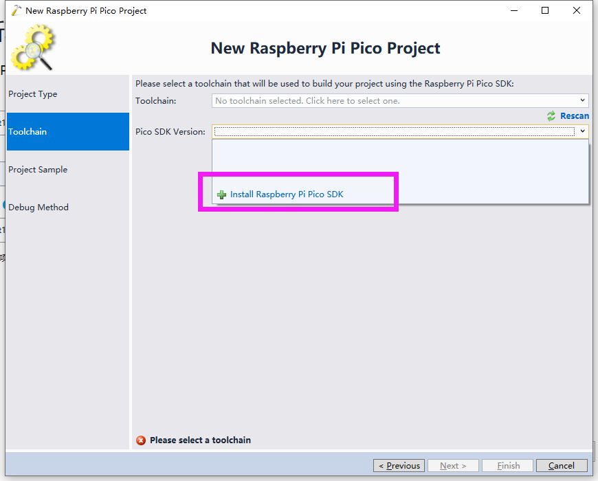  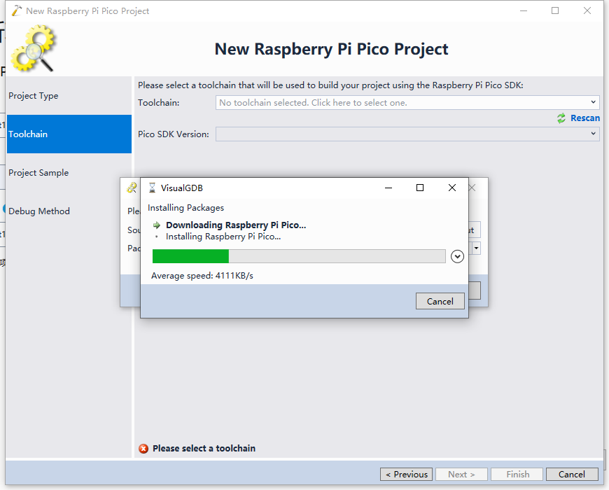  跑马灯的例子溜溜  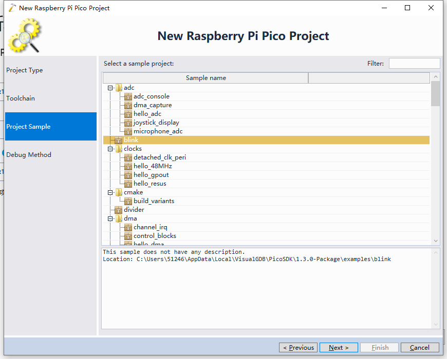  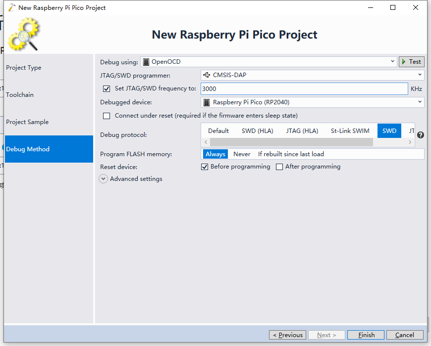  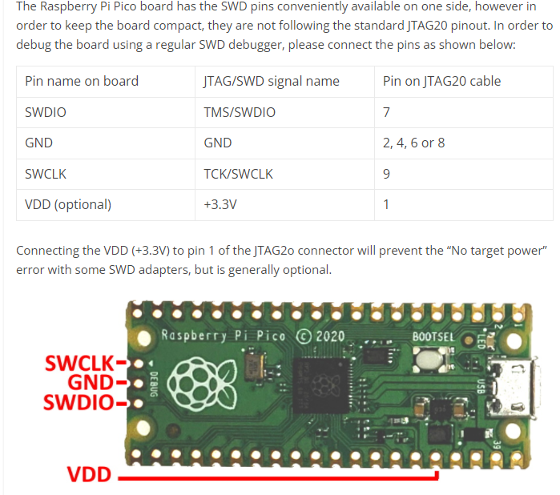  **TOOL使用三线连接方式即可：** 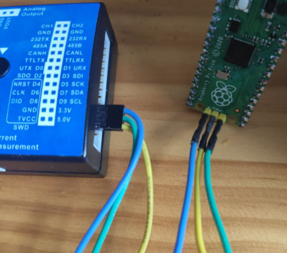   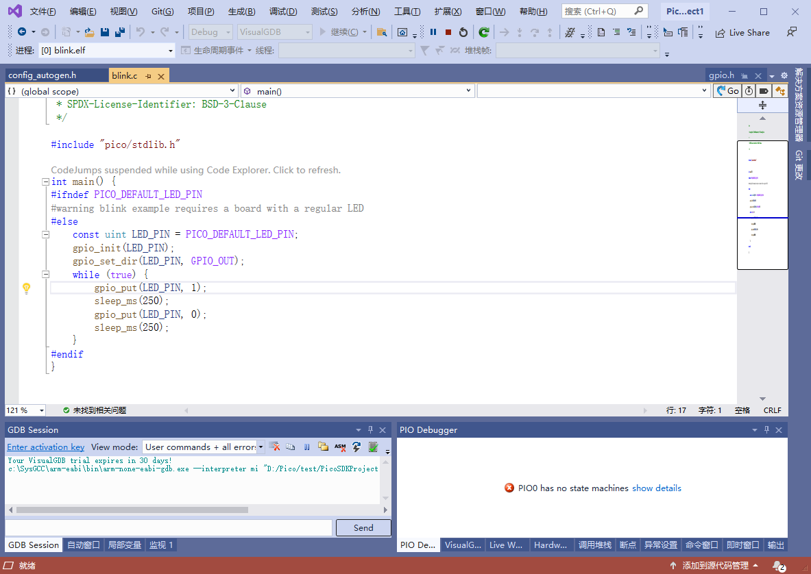

> 剩下的就是怎么破解VisualGDB的问题了
>
> 测试发现不用破解，30天试用结束过期后继续用。