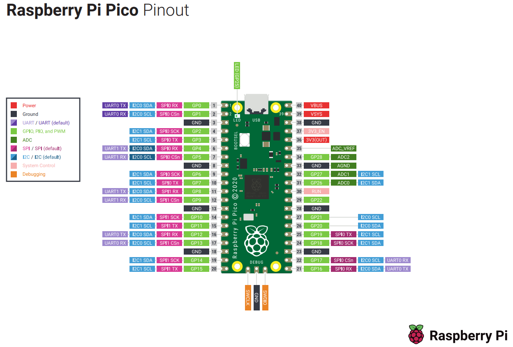

**官网：** https://www.raspberrypi.com/documentation/microcontrollers/  **在线文档：** https://raspberrypi.github.io/pico-sdk-doxygen/  **Github SDK :** https://github.com/raspberrypi/pico-sdk  **Github example ：** https://github.com/raspberrypi/pico-examples  **数据手册：** [rp2040-datasheet.pdf](https://img.anfulai.cn/bbs/111733/rp2040-datasheet.pdf) (4.91MB)  **FAQ:** [raspberry-pi-pico-faq.pdf](https://img.anfulai.cn/bbs/111733/raspberry-pi-pico-faq.pdf) (113.45KB)  **上手手册（各种开发环境搭建）：** [getting-started-with-pico.pdf](https://img.anfulai.cn/bbs/111733/getting-started-with-pico.pdf) (32.95MB)    **C SDK开发：** [raspberry-pi-pico-c-sdk.pdf](https://img.anfulai.cn/bbs/111733/raspberry-pi-pico-c-sdk.pdf) (3.70MB)    **Python SDK开发：** [raspberry-pi-pico-python-sdk.pdf](https://img.anfulai.cn/bbs/111733/raspberry-pi-pico-python-sdk.pdf) (1.73MB)      