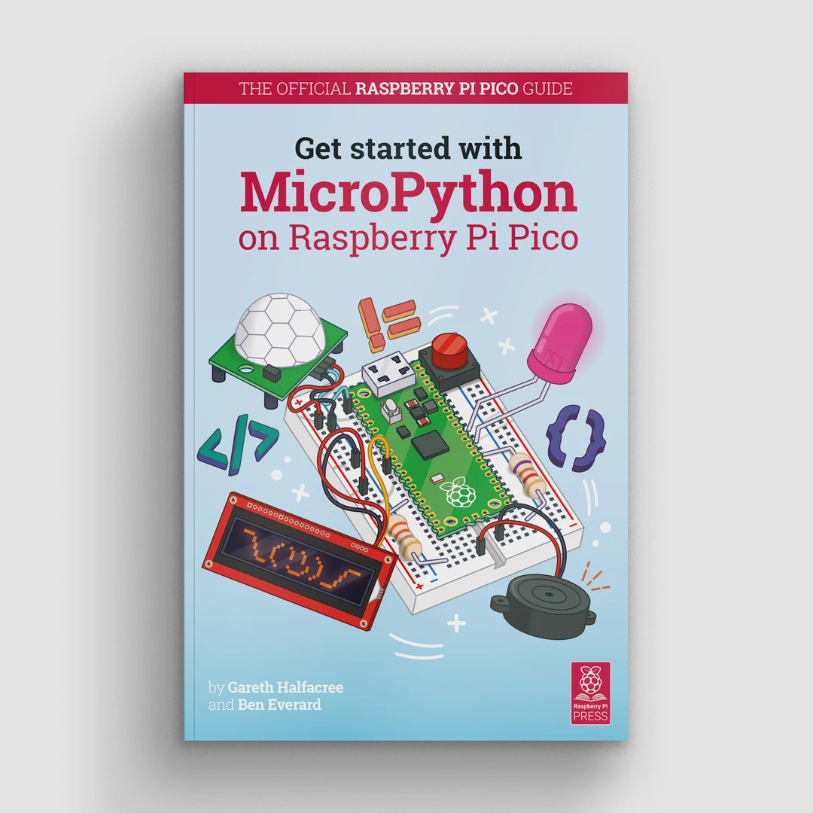

[raspberrypi doc](https://www.raspberrypi.com/documentation/microcontrollers/rp2040.html#raspberry-pi-pico) 

# RP2040

## Welcome to RP2040

Edit this [on GitHub](https://github.com/raspberrypi/documentation/blob/develop/documentation/asciidoc/microcontrollers/rp2040/about_rp2040.adoc)

Welcome to RP2040, a microcontroller designed here at Raspberry Pi.


Whether you have a [Raspberry Pi Pico](https://www.raspberrypi.com/documentation/microcontrollers/raspberry-pi-pico.html#technical-specification) or another RP2040-based microcontroller board, everything you need to get started is here. You’ll find support for getting started with [C/C++](https://www.raspberrypi.com/documentation/microcontrollers/c_sdk.html#sdk-setup) or [MicroPython](https://www.raspberrypi.com/documentation/microcontrollers/micropython.html#what-is-micropython) on Raspberry Pi Pico, and links to resources for other boards that use RP2040. There are also links to the technical documentation for both the Raspberry Pi Pico microcontroller board and our RP2040 microcontroller chip.

## Technical Specification

Edit this [on GitHub](https://github.com/raspberrypi/documentation/blob/develop/documentation/asciidoc/microcontrollers/rp2040/technical_specification.adoc)

RP2040 is the debut microcontroller from Raspberry Pi. It brings our signature values of high performance, low cost, and ease of use to the microcontroller space.

With a large on-chip memory, symmetric dual-core processor complex, deterministic bus fabric, and rich peripheral set augmented with our unique Programmable I/O (PIO) subsystem, it provides professional users with unrivalled power and flexibility. With detailed documentation, a polished MicroPython port, and a UF2 bootloader in ROM, it has the lowest possible barrier to entry for beginner and hobbyist users.

RP2040 is a stateless device, with support for cached execute-in-place from external QSPI memory. This design decision allows you to choose the appropriate density of non-volatile storage for your application, and to benefit from the low pricing of commodity Flash parts.

RP2040 is manufactured on a modern 40nm process node, delivering high performance, low dynamic power consumption, and low leakage, with a variety of low-power modes to support extended-duration operation on battery power

Key features:

- Dual ARM Cortex-M0+ @ 133MHz
- 264kB on-chip SRAM in six independent banks
- Support for up to 16MB of off-chip Flash memory via dedicated QSPI bus
- DMA controller
- Fully-connected AHB crossbar
- Interpolator and integer divider peripherals
- On-chip programmable LDO to generate core voltage
- 2 on-chip PLLs to generate USB and core clocks
- 30 GPIO pins, 4 of which can be used as analogue inputs
- Peripherals
  - 2 UARTs
  - 2 SPI controllers
  - 2 I2C controllers
  - 16 PWM channels
  - USB 1.1 controller and PHY, with host and device support
  - 8 PIO state machines

### Why is the chip called RP2040?

The post-fix numeral on RP2040 comes from the following,


1. Number of processor cores (2)
2. Loosely which type of processor (M0+)
3. floor(log2(ram / 16k))
4. floor(log2(nonvolatile / 16k)) or 0 if no onboard nonvolatile storage

### Design Files

- Download [Minimal Viable Board](https://datasheets.raspberrypi.com/rp2040/Minimal-KiCAD.zip) Design Files (KiCad)
- Download [VGA Carrier Board](https://datasheets.raspberrypi.com/rp2040/VGA-KiCAD.zip) Design Files (KiCad)

## Internal Temperature Sensor

Edit this [on GitHub](https://github.com/raspberrypi/documentation/blob/develop/documentation/asciidoc/microcontrollers/rp2040/temp_sensor.adoc)

The internal temperature sensor in the RP2040 package is a low-resolution sensor that needs to be user-calibrated to be useful to any degree of accuracy.

A crucial part of accurately determining the temperature measured is knowing the ADC VREF voltage. The conversion formula means that small errors in the ADC VREF voltage can give quite large discrepancies in temperature calculated. The RP2040 doesn’t have an internal Fixed Voltage Reference which can be used to determine VREF voltage so VREF voltage needs to be measured manually - with the caveat it could change - or an external Fixed Voltage Reference needs to be provided.

| NOTE | The RP2040 sensor voltage falls as temperature rises. |
| ---- | ----------------------------------------------------- |
|      |                                                       |

See Chapter 4, section 4.9.5 of the [RP2040 Datasheet](https://datasheets.raspberrypi.com/rp2040/rp2040-datasheet.pdf) for further details of the internal temperature sensor.

## Documentation

Edit this [on GitHub](https://github.com/raspberrypi/documentation/blob/develop/documentation/asciidoc/microcontrollers/microcontroller_docs.adoc)

Documentation for Raspberry Pi Pico and other RP2040-based boards.

### RP2040 Device

- [RP2040 Datasheet](https://datasheets.raspberrypi.com/rp2040/rp2040-datasheet.pdf)

  A microcontroller by Raspberry Pi

- [Hardware design with RP2040](https://datasheets.raspberrypi.com/rp2040/hardware-design-with-rp2040.pdf)

  Using RP2040 microcontrollers to build boards and products

### Raspberry Pi Pico

- [Raspberry Pi Pico Datasheet](https://datasheets.raspberrypi.com/pico/pico-datasheet.pdf)

  An RP2040-based microcontroller board

- [Getting started with Raspberry Pi Pico](https://datasheets.raspberrypi.com/pico/getting-started-with-pico.pdf)

  C/C++ development with Raspberry Pi Pico and other RP2040-based microcontroller boards

### Raspberry Pi Pico W

- [Raspberry Pi Pico W Datasheet](https://datasheets.raspberrypi.com/picow/pico-w-datasheet.pdf)

  An RP2040-based microcontroller board with wireless

- [Connecting to the Internet with Raspberry Pi Pico W](https://datasheets.raspberrypi.com/picow/connecting-to-the-internet-with-pico-w.pdf)

  Getting Raspberry Pi Pico W online with C/C++ or MicroPython

### Software Development

- [Raspberry Pi Pico C/C++ SDK](https://datasheets.raspberrypi.com/pico/raspberry-pi-pico-c-sdk.pdf)

  Libraries and tools for C/C++ development on RP2040 microcontrollers

- [Raspberry Pi Pico Python SDK](https://datasheets.raspberrypi.com/pico/raspberry-pi-pico-python-sdk.pdf)

  A MicroPython environment for RP2040 microcontrollers

The API level Doxygen documentation for the Raspberry Pi Pico C/C++ SDK is also available [as a micro-site](https://rptl.io/pico-doxygen).

| NOTE | A [one-click installer](https://github.com/raspberrypi/pico-setup-windows/releases/latest/download/pico-setup-windows-x64-standalone.exe) for the Pico C/C++ SDK for Windows 10 and Windows 11 is available. |
| ---- | ------------------------------------------------------------ |
|      |                                                              |

## RP2040-based Boards

Edit this [on GitHub](https://github.com/raspberrypi/documentation/blob/develop/documentation/asciidoc/microcontrollers/rp2040/rp2040_based_boards.adoc)

Designed by Raspberry Pi as both a development board, and as a reference design, the [Raspberry Pi Pico](https://www.raspberrypi.com/documentation/microcontrollers/raspberry-pi-pico.html) series is a family of RP2040-based boards. The Pico family currently consists of Raspberry Pi Pico (far left), Pico H (left), Pico W (right), and Pico WH (far right).


The design files for Raspberry Pi Pico and Pico W are available openly, with no limitations.

- Download [Design Files](https://datasheets.raspberrypi.com/pico/RPi-Pico-R3-PUBLIC-20200119.zip) for Raspberry Pi Pico (Cadence Allegro)
- Download [Design Files](https://datasheets.raspberrypi.com/picow/RPi-PicoW-PUBLIC-20220607.zip) for Raspberry Pi Pico W (Cadence Allegro)

Permission to use, copy, modify, and/or distribute this design for any purpose with or without fee is hereby granted.

THE DESIGN IS PROVIDED "AS IS" AND THE AUTHOR DISCLAIMS ALL WARRANTIES WITH REGARD TO THIS DESIGN INCLUDING ALL IMPLIED WARRANTIES OF MERCHANTABILITY AND FITNESS. IN NO EVENT SHALL THE AUTHOR BE LIABLE FOR ANY SPECIAL, DIRECT, INDIRECT, OR CONSEQUENTIAL DAMAGES OR ANY DAMAGES WHATSOEVER RESULTING FROM LOSS OF USE, DATA OR PROFITS, WHETHER IN AN ACTION OF CONTRACT, NEGLIGENCE OR OTHER TORTIOUS ACTION, ARISING OUT OF OR IN CONNECTION WITH THE USE OR PERFORMANCE OF THIS DESIGN.

### Other Boards

Discussions around other third party RP2040-based boards can be found on the [Raspberry Pi forums](https://forums.raspberrypi.com/viewforum.php?f=147).

# Raspberry Pi Pico and Pico W

## The family

Edit this [on GitHub](https://github.com/raspberrypi/documentation/blob/develop/documentation/asciidoc/microcontrollers/raspberry-pi-pico/about_pico.adoc)


The Raspberry Pi Pico family currently consists of four boards; Raspberry Pi Pico (far left), Pico H (middle left), Pico W (middle right), and Pico WH (far right).

## Raspberry Pi Pico and Pico H

Raspberry Pi Pico is a low-cost, high-performance microcontroller board with flexible digital interfaces. Key features include:

- [RP2040](https://www.raspberrypi.com/documentation/microcontrollers/rp2040.html#welcome-to-rp2040) microcontroller chip designed by Raspberry Pi in the United Kingdom
- Dual-core Arm Cortex M0+ processor, flexible clock running up to 133 MHz
- 264kB of SRAM, and 2MB of on-board flash memory
- USB 1.1 with device and host support
- Low-power sleep and dormant modes
- Drag-and-drop programming using mass storage over USB
- 26 × multi-function GPIO pins
- 2 × SPI, 2 × I2C, 2 × UART, 3 × 12-bit ADC, 16 × controllable PWM channels
- Accurate clock and timer on-chip
- Temperature sensor
- Accelerated floating-point libraries on-chip
- 8 × Programmable I/O (PIO) state machines for custom peripheral support

The Raspberry Pi Pico comes as a castellated module allows soldering direct to carrier boards, while the Pico H comes with pre-soldered headers.

| NOTE | Both boards have a three pin Serial Wire Debug (SWD) header. However, the Pico H has this broken out into a small, keyed, [3-pin connector](https://datasheets.raspberrypi.com/debug/debug-connector-specification.pdf) while the Pico has three castellated through-hole pins adjacent to the edge of the board. |
| ---- | ------------------------------------------------------------ |
|      |                                                              |

### Pinout and design files


- Download the [Pinout Diagram](https://datasheets.raspberrypi.com/pico/Pico-R3-A4-Pinout.pdf) (PDF)
- Download [Design Files](https://datasheets.raspberrypi.com/pico/RPi-Pico-R3-PUBLIC-20200119.zip) (Cadence Allegro)
- Download [STEP File](https://datasheets.raspberrypi.com/pico/Pico-R3-step.zip)
- Download [Fritzing Part](https://datasheets.raspberrypi.com/pico/Pico-R3-Fritzing.fzpz) for Raspberry Pi Pico
- Download [Fritzing Part](https://datasheets.raspberrypi.com/pico/PicoH-Fritzing.fzpz) for Raspberry Pi Pico H

| NOTE | More information on Fritzing is available on the [fritzing.org](https://fritzing.org/) website. |
| ---- | ------------------------------------------------------------ |
|      |                                                              |

## Raspberry Pi Pico W and Pico WH

Raspberry Pi Pico W adds on-board single-band 2.4GHz wireless interfaces (802.11n) using the Infineon CYW43439 while retaining the Pico form factor. The on-board 2.4GHz wireless interface has the following features:

- Wireless (802.11n), single-band (2.4 GHz)
- WPA3
- Soft access point supporting up to four clients

The antenna is an onboard antenna licensed from ABRACON (formerly ProAnt). The wireless interface is connected via SPI to the [RP2040](https://www.raspberrypi.com/documentation/microcontrollers/rp2040.html#welcome-to-rp2040) microcontroller.

Due to pin limitations, some of the wireless interface pins are shared. The CLK is shared with VSYS monitor, so only when there isn’t an SPI transaction in progress can VSYS be read via the ADC. The Infineon CYW43439 DIN/DOUT and IRQ all share one pin on the RP2040. Only when an SPI transaction isn’t in progress is it suitable to check for IRQs. The interface typically runs at 33MHz.

For best wireless performance, the antenna should be in free space. For instance, putting metal under or close by the antenna can reduce its performance both in terms of gain and bandwidth. Adding grounded metal to the sides of the antenna can improve the antenna’s bandwidth.

| NOTE | The CYW43439 wireless chip is connected via SPI to the RP2040. While the CYW43439 supports both 802.11 wireless and Bluetooth, initially Pico W does not have Bluetooth support. Support may be added later, and will use the same SPI interface. If support is added existing hardware may require a firmware update to support Bluetooth, but there will be no hardware modifications needed. |
| ---- | ------------------------------------------------------------ |
|      |                                                              |

### Pinout and design files


- Download the [Pinout Diagram](https://datasheets.raspberrypi.com/picow/PicoW-A4-Pinout.pdf) (PDF)
- Download [Design Files](https://datasheets.raspberrypi.com/picow/RPi-PicoW-PUBLIC-20220607.zip) (Cadence Allegro)
- Download [STEP File](https://datasheets.raspberrypi.com/picow/PicoW-step.zip)
- Download [Fritzing Part](https://datasheets.raspberrypi.com/picow/PicoW-Fritzing.fzpz) for Rapsberry Pi Pico W

## Documentation

Edit this [on GitHub](https://github.com/raspberrypi/documentation/blob/develop/documentation/asciidoc/microcontrollers/microcontroller_docs.adoc)

Documentation for Raspberry Pi Pico and other RP2040-based boards.

### RP2040 Device

- [RP2040 Datasheet](https://datasheets.raspberrypi.com/rp2040/rp2040-datasheet.pdf)

  A microcontroller by Raspberry Pi

- [Hardware design with RP2040](https://datasheets.raspberrypi.com/rp2040/hardware-design-with-rp2040.pdf)

  Using RP2040 microcontrollers to build boards and products

### Raspberry Pi Pico

- [Raspberry Pi Pico Datasheet](https://datasheets.raspberrypi.com/pico/pico-datasheet.pdf)

  An RP2040-based microcontroller board

- [Getting started with Raspberry Pi Pico](https://datasheets.raspberrypi.com/pico/getting-started-with-pico.pdf)

  C/C++ development with Raspberry Pi Pico and other RP2040-based microcontroller boards

### Raspberry Pi Pico W

- [Raspberry Pi Pico W Datasheet](https://datasheets.raspberrypi.com/picow/pico-w-datasheet.pdf)

  An RP2040-based microcontroller board with wireless

- [Connecting to the Internet with Raspberry Pi Pico W](https://datasheets.raspberrypi.com/picow/connecting-to-the-internet-with-pico-w.pdf)

  Getting Raspberry Pi Pico W online with C/C++ or MicroPython

### Software Development

- [Raspberry Pi Pico C/C++ SDK](https://datasheets.raspberrypi.com/pico/raspberry-pi-pico-c-sdk.pdf)

  Libraries and tools for C/C++ development on RP2040 microcontrollers

- [Raspberry Pi Pico Python SDK](https://datasheets.raspberrypi.com/pico/raspberry-pi-pico-python-sdk.pdf)

  A MicroPython environment for RP2040 microcontrollers

The API level Doxygen documentation for the Raspberry Pi Pico C/C++ SDK is also available [as a micro-site](https://rptl.io/pico-doxygen).

| NOTE | A [one-click installer](https://github.com/raspberrypi/pico-setup-windows/releases/latest/download/pico-setup-windows-x64-standalone.exe) for the Pico C/C++ SDK for Windows 10 and Windows 11 is available. |
| ---- | ------------------------------------------------------------ |
|      |                                                              |

## Software Utilities

Edit this [on GitHub](https://github.com/raspberrypi/documentation/blob/develop/documentation/asciidoc/microcontrollers/raspberry-pi-pico/utilities.adoc)

### What is on your Pico?

If you have forgotten what has been programmed into your Raspberry Pi Pico, and the program was built using our Pico C/C++ SDK, it will usually have a name and other useful information embedded into the binary. You can use the [Picotool](https://github.com/raspberrypi/picotool) command line utility to find out these details. Full instructions on how to use Picotool to do this are available in our '[getting started](https://datasheets.raspberrypi.com/pico/getting-started-with-pico.pdf)' documentation.

- Go to the [Picotool Github repository](https://github.com/raspberrypi/picotool).

### Debugging using another Raspberry Pi Pico

It is possible to use one Raspberry Pi Pico to debug another Pico. This is possible via picoprobe, an application that allows a Pico to act as a USB → SWD and UART converter. This makes it easy to use a Pico on non-Raspberry Pi platforms such as Windows, Mac, and Linux computers where you don’t have GPIOs to connect directly to your Pico. Full instructions on how to use Picoprobe to do this are available in our '[getting started](https://datasheets.raspberrypi.com/pico/getting-started-with-pico.pdf)' documentation.

- Download the [UF2 file](https://github.com/raspberrypi/picoprobe/releases/latest/download/picoprobe.uf2)
- Go to the [Picoprobe Github repository](https://github.com/raspberrypi/picoprobe)

### Resetting Flash memory

Pico’s BOOTSEL mode lives in read-only memory inside the RP2040 chip, and can’t be overwritten accidentally. No matter what, if you hold down the BOOTSEL button when you plug in your Pico, it will appear as a drive onto which you can drag a new UF2 file. There is no way to brick the board through software. However, there are some circumstances where you might want to make sure your Flash memory is empty. You can do this by dragging and dropping a special UF2 binary onto your Pico when it is in mass storage mode.

- Download the [UF2 file](https://datasheets.raspberrypi.com/soft/flash_nuke.uf2)
- See the [code on Github](https://github.com/raspberrypi/pico-examples/blob/master/flash/nuke/nuke.c)

# Raspberry Pi Debug Probe

## About the Debug Probe

Edit this [on GitHub](https://github.com/raspberrypi/documentation/blob/develop/documentation/asciidoc/microcontrollers/debug-probe/introduction.adoc)


The Raspberry Pi Debug Probe is a USB device that provides both a UART serial port and a standard Arm Serial Wire Debug (SWD) interface. The probe is designed for easy, solderless, plug-and-play debugging. It has the following features:

- USB to ARM [Serial Wire Debug](https://developer.arm.com/documentation/ihi0031/a/The-Serial-Wire-Debug-Port--SW-DP-/Introduction-to-the-ARM-Serial-Wire-Debug--SWD--protocol) (SWD) port
- USB to UART bridge
- Compatible with the [CMSIS-DAP](https://developer.arm.com/documentation/101451/0100/About-CMSIS-DAP) standard
- Works with [OpenOCD](https://openocd.org/) and other tools supporting CMSIS-DAP
- Open source, easily upgradeable firmware

| NOTE | For more information on the Raspberry Pi three-pin debug connector see the [specification](https://rptl.io/debug-spec). |
| ---- | ------------------------------------------------------------ |
|      |                                                              |

This makes it easy to use a Raspberry Pi Pico on non-Raspberry Pi platforms such as Windows, Mac, and “normal” Linux computers, where you don’t have a GPIO header to connect directly to the Pico’s serial UART or SWD port.

### The Debug Probe

The probe operates at 3.3V nominal I/O voltage.


Included with the Debug Probe is a USB power cable and three debug cables:

- 3-pin JST connector to 3-pin JST connector cable
- 3-pin JST connector to 0.1-inch header (female)
- 3-pin JST connector to 0.1-inch header (male)

The two 0.1-inch header cables — intended for breadboard (male) or direct connection to a board with header pins (female) — are coloured as below:

- Orange

  TX/SC (Output from Probe)

- Black

  GND

- Yellow

  RX/SD (Input to Probe or I/O)

While the cable with 3-pin JST connectors is intended to be used with the [standard 3-pin connector](https://rptl.io/debug-spec) which newer Raspberry Pi boards use for the SWD debug port and UART connectors.

The Debug Probe has five LEDs, a red LED to indicate power, and four more activity indicator LEDs


| NOTE | OpenOCD just switches both DAP LEDs on when the target is connected, and turns them off when it calls `DAP_DISCONNECT`. |
| ---- | ------------------------------------------------------------ |
|      |                                                              |

## Getting started

Edit this [on GitHub](https://github.com/raspberrypi/documentation/blob/develop/documentation/asciidoc/microcontrollers/debug-probe/getting-started.adoc)


Depending on your setup, there are several ways to wire the Debug Probe to a [Raspberry Pi Pico](https://www.raspberrypi.com/documentation/microcontrollers/raspberry-pi-pico.html). Below, we connect the Debug Probe to a Raspberry Pi Pico H which has the newer three-pin JST connector for SWD.

<iframe src="https://www.youtube.com/embed/4RCZBZsfsek?rel=0" frameborder="0" allowfullscreen="" style="box-sizing: border-box; position: absolute; top: 0px; left: 0px; width: 732.39px; height: 431.961px; border: 0px;"></iframe>

Here we have connected:

- The Debug Probe "D" connector to Pico H SWD JST connector
- The Debug Probe "U" connector has the three-pin JST connector to 0.1-inch header (male)
  - Debug Probe RX connected to Pico H TX pin
  - Debug Probe TX connected to Pico H RX pin
  - Debug Probe GND connected to Pico H GND pin

| NOTE | If you have an "original" Raspberry Pi Pico, or Pico W, without a JST connector, you can still connect it to a Debug Probe. To do so, solder a male connector to the SWDCLK, SWDIO and GND header pins on the board, and connect them to the Debug Probe "D" connector using the alternate 3-pin JST connector to 0.1-inch header (female) cable included with the Debug Probe. |
| ---- | ------------------------------------------------------------ |
|      |                                                              |


## Installing Tools

Edit this [on GitHub](https://github.com/raspberrypi/documentation/blob/develop/documentation/asciidoc/microcontrollers/debug-probe/installing-tools.adoc)

Before we get started we need to install some tools.

### Installing OpenOCD

You need to install OpenOCD.

| NOTE | SMP support for debugging on both RP2040 cores is not yet available in the release version of `openocd`. However, support is available in the `rp2040` branch and will be enabled if you build from source. |
| ---- | ------------------------------------------------------------ |
|      |                                                              |

#### Linux (and Raspberry Pi)

On Raspberry Pi OS you can install `openocd` directly from the command line.

```
$ sudo apt install openocd
```

You need to be running OpenOCD version 0.11.0 or 0.12.0 to have support for the Debug Probe. If you’re not running Raspberry Pi OS, or your distribution installs an older version, or require SMP support, you can build and install `openocd` from source.

Start by installing needed dependencies,

```
$ sudo apt install automake autoconf build-essential texinfo libtool libftdi-dev libusb-1.0-0-dev
```

and then build OpenOCD.

```
$ git clone https://github.com/raspberrypi/openocd.git --branch rp2040 --depth=1 --no-single-branch
$ cd openocd
$ ./bootstrap
$ ./configure
$ make -j4
$ sudo make install
```

| NOTE | If you are building on a Raspberry Pi you can also pass `--enable-sysfsgpio --enable-bcm2835gpio` when you `./configure` to allow bit-banging SWD via the GPIO pins. See Chapters 5 and 6 of [Getting Started with Raspberry Pi Pico](https://datasheets.raspberrypi.com/pico/getting-started-with-pico.pdf) for more details. |
| ---- | ------------------------------------------------------------ |
|      |                                                              |

#### macOS

Install [Homebrew](https://brew.sh/) if needed,

```
$ /bin/bash -c "$(curl -fsSL https://raw.githubusercontent.com/Homebrew/install/master/install.sh)"
```

and then OpenOCD.

```
$ brew install open-ocd
```

Alternatively you can install needed dependencies,

```
$ brew install libtool automake libusb wget pkg-config gcc texinfo
```

and build OpenOCD from source.

```
$ cd ~/pico
$ git clone https://github.com/raspberrypi/openocd.git --branch rp2040 --depth=1
$ cd openocd
$ export PATH="/usr/local/opt/texinfo/bin:$PATH"
$ ./bootstrap
$ ./configure --disable-werror
$ make -j4
$ sudo make install
```

| NOTE | If you are using a newer Arm-based Mac, the path to `texinfo` will be `/opt/homebrew/opt/texinfo/bin`. |
| ---- | ------------------------------------------------------------ |
|      |                                                              |

| NOTE | Unfortunately `disable-werror` is needed because not everything compiles cleanly on macOS |
| ---- | ------------------------------------------------------------ |
|      |                                                              |

#### MS Windows

A standalone OpenOCD Windows package is available [for download](https://github.com/raspberrypi/pico-setup-windows/releases/latest/download/openocd-x64-standalone.zip). Alternatively it will be installed as part of our [Pico setup for Windows installer](https://github.com/raspberrypi/pico-setup-windows/releases/latest) package.

But, if you want to, you can also build OpenOCD from source using [MSYS2](https://www.msys2.org/). Go ahead and download and run the MSYS2 installer, and then update the package database and core system packages,

```
$ pacman -Syu
```

| NOTE | If MSYS2 closes, start it again (making sure you select the 64-bit version) and run `pacman -Su` to finish the update. |
| ---- | ------------------------------------------------------------ |
|      |                                                              |

Install required dependencies,

```
$ pacman -S mingw-w64-x86_64-toolchain git make libtool pkg-config autoconf automake texinfo
mingw-w64-x86_64-libusb
```

Pick all when installing the `mingw-w64-x86_64` toolchain by pressing ENTER.

Close MSYS2 and reopen the 64-bit version to make sure the environment picks up GCC,

```
$ git clone https://github.com/raspberrypi/openocd.git --branch rp2040 --depth=1
$ cd openocd
$ ./bootstrap
$ ./configure --disable-werror
$ make -j4
```

| NOTE | Unfortunately `disable-werror` is needed because not everything compiles cleanly on Windows |
| ---- | ------------------------------------------------------------ |
|      |                                                              |

| NOTE | Manual installation of `openocd` on MS Windows is not recommended. |
| ---- | ------------------------------------------------------------ |
|      |                                                              |

### Installing GDB

We also need to install the GNU debugger (GDB).

#### Linux (and Raspberry Pi)

Install `gdb-multiarch`.

```
$ sudo apt install gdb-multiarch
```

#### macOS

Install [Homebrew](https://brew.sh/) if needed,

```
$ /bin/bash -c "$(curl -fsSL https://raw.githubusercontent.com/Homebrew/install/master/install.sh)"
```

then install `gdb`.

```
$ brew install gdb
```

| NOTE | You can safely ignore the request for "special privileges" messages on installation. |
| ---- | ------------------------------------------------------------ |
|      |                                                              |

| IMPORTANT | If you have an Arm-based (M1-based) Mac `gdb` is not available via Homebrew, instead you will either have to [install it from source](https://gist.github.com/m0sys/711d0ec5e52102c6ba44451caf38bd38) or use `lldb` instead of `gdb`. At this time there is [no official support](https://inbox.sourceware.org/gdb/3185c3b8-8a91-4beb-a5d5-9db6afb93713@Spark/) from the developers for running GDB on Arm-based Macs. Support for GDB can be found on the [GDB mailing list](https://inbox.sourceware.org/gdb/) on Sourceware.org. `lldb` is installed as part of the Xcode Command Line Tools. |
| --------- | ------------------------------------------------------------ |
|           |                                                              |

#### MS Windows

GDB is available as part of our [Pico setup for Windows installer](https://github.com/raspberrypi/pico-setup-windows/releases/latest). It is also included in the [Arm GNU Toolchain Downloads](https://developer.arm.com/downloads/-/arm-gnu-toolchain-downloads).

Alternatively information about manual installation can be found in Chapter 9 and Appendix A of our [Getting Started with Raspberry Pi Pico](https://datasheets.raspberrypi.com/pico/getting-started-with-pico.pdf) book.

| NOTE | Manual installation of GDB on Windows is not recommended. |
| ---- | --------------------------------------------------------- |
|      |                                                           |

## Serial Wire Debug (SWD)

Edit this [on GitHub](https://github.com/raspberrypi/documentation/blob/develop/documentation/asciidoc/microcontrollers/debug-probe/swd-connection.adoc)

Serial Wire Debug (SWD) is a two-pin interface ([SWDIO and SWCLK](https://developer.arm.com/documentation/101761/1-0/Debug-and-trace-interface/Serial-Wire-Debug-signals)) alternative to the JTAG four- or five-pin debugging interface standard.

### Uploading new programs to your Pico

The Pico Debug Probe will let you load binaries via the SWD port and OpenOCD: you will not need to unplug, and then push-and-hold, the BOOTSEL button every time you push a new binary to your Pico. Using the Debug Probe uploading new binaries is an entirely hands off affair.

Once you have built a binary:

```
$  sudo openocd -f interface/cmsis-dap.cfg -f target/rp2040.cfg -c "adapter speed 5000" -c "program blink.elf verify reset exit"
```

| NOTE | When you use the Debug Probe to upload a binary the ELF version of the file is used, not the UF2 file that you would use when you drag-and-drop. |
| ---- | ------------------------------------------------------------ |
|      |                                                              |

### Debugging with SWD

It’ll also let you use `openocd` in server mode, and connect GDB, which gives you break points and “proper” debugging.

| IMPORTANT | To allow debugging, you must build your binaries as `Debug` rather than `Release` build type, e.g.`$ cd ~/pico/pico-examples/ $ rm -rf build $ mkdir build $ cd build $ export PICO_SDK_PATH=../../pico-sdk $ cmake -DCMAKE_BUILD_TYPE=Debug .. $ cd blink $ make -j4`In a debug build you will get more information when you run it under the debugger, as the compiler builds your program with the information to tell GDB what your program is doing.See Chapter 6 of [Getting started with Raspberry Pi Pico](https://datasheets.raspberrypi.com/pico/getting-started-with-pico.pdf) for more information. |
| --------- | ------------------------------------------------------------ |
|           |                                                              |

Run OpenOCD 'server' ready to attach GDB to:

```
$ sudo openocd -f interface/cmsis-dap.cfg -f target/rp2040.cfg -c "adapter speed 5000"
```

Then open a second terminal window, switch to the directory containing your built binary, and start GDB.

```
$ gdb blink.elf
> target remote localhost:3333
> monitor reset init
> continue
```

| NOTE | On non-Raspberry Pi Linux platforms you should invoke GDB by using `gdb-multiarch blink.elf`. |
| ---- | ------------------------------------------------------------ |
|      |                                                              |

| NOTE | If you are on an Arm-based (M1) Mac without `gdb`, you can make use of `lldb`, which is installed along with the XCode Command Line Tools. The syntax used by `lldb` is [slightly different](https://lldb.llvm.org/use/map.html) to `gdb`.`$ lldb blink.elf (lldb) gdb-remote 3333 (lldb) process plugin packet monitor reset (lldb) continue` |
| ---- | ------------------------------------------------------------ |
|      |                                                              |

## Serial connections

Edit this [on GitHub](https://github.com/raspberrypi/documentation/blob/develop/documentation/asciidoc/microcontrollers/debug-probe/uart-connection.adoc)

Ensure that the Debug Probe is connected to the UART pins of your Raspberry Pi Pico.


The default pins for Raspberry Pi Pico UART0 are as follows:

| Default UART0 | Physical Pin | GPIO Pin |
| :------------ | :----------- | :------- |
| GND           | 3            | N/A      |
| UART0_TX      | 1            | GP0      |
| UART0_RX      | 2            | GP1      |

Once connected, traffic over the Raspberry Pi Pico’s UART will be relayed to your computer by the Debug Probe and exposed as a CDC UART. On a Raspberry Pi this will show up as `/dev/ttyACM0`; on other platforms this serial port will show up differently (e.g. on macOS it will appear as `/dev/cu.usbmodemXXXX`).

If you have not already done so you should install minicom:

```
$ sudo apt install minicom
```

and open the serial port:

```
$ minicom -b 115200 -o -D /dev/ttyACM0
```

| TIP  | To exit `minicom`, use CTRL-A followed by X. |
| ---- | -------------------------------------------- |
|      |                                              |

To test serial communication you can build and upload the "Hello World" example application.

Change directory into the `hello_world` directory inside the `pico-examples` tree, and run `make`. Afterwards, you can upload it to your Raspberry Pi Pico using `openocd`. For a full walkthrough of building the `hello_serial` example program, see Chapter 4 of [Getting started with Raspberry Pi Pico](https://datasheets.raspberrypi.com/pico/getting-started-with-pico.pdf).

```
$ cd pico-examples
$ mkdir build
$ cd build
$ export PICO_SDK_PATH=../../pico-sdk
$ cmake ..
$ cd hello_world/serial
$ make -j4
$ sudo openocd -f interface/cmsis-dap.cfg -f target/rp2040.cfg -c "adapter speed 5000" -c "program hello_serial.elf verify reset exit"
$ minicom -b 115200 -o -D /dev/ttyACM0
```

On opening `minicom` you should see "Hello, world!" printed to the console.

For terminal programs that support it, a description of the USB serial UART is advertised in the USB device description.


The unique serial number in this description means that on Windows your COM port numbering is "sticky" per device, and will allow you to write `udev` rules to associate a named device node with a particular Debug Probe.

## Updating the firmware on the Debug Probe

Edit this [on GitHub](https://github.com/raspberrypi/documentation/blob/develop/documentation/asciidoc/microcontrollers/debug-probe/updating-firmware.adoc)

| NOTE | There is currently no newer version of the firmware. The firmware running on your Debug Probe is the latest available. If you have accidentally overwritten the firmware on your Debug Probe, the [latest release of the firmware](https://github.com/raspberrypi/picoprobe/releases/latest/download/debugprobe.uf2) can be found [on Github](https://github.com/raspberrypi/picoprobe/releases/latest). |
| ---- | ------------------------------------------------------------ |
|      |                                                              |

From time to time you may need to update the Debug Probe firmware. New firmware for the debug probe will be made available as a UF2 file distributed by Raspberry Pi.

Pinch to remove the top of the Debug Probe enclosure, then push and hold the BOOTSEL button as you plug the Debug Probe into your computer. This will mount an RPI-RP2 volume on your desktop. Drag-and-drop the firmware UF2 onto the RPI-RP2 volume. The firmware will be copied to the Debug Probe and the volume will dismount.

Your Debug Probe will reboot. You are now running an updated version of the Debug Probe firmware.

## Schematics

Edit this [on GitHub](https://github.com/raspberrypi/documentation/blob/develop/documentation/asciidoc/microcontrollers/debug-probe/schematics.adoc)

Schematics and mechanical drawing of the Debug Probe are available:

- [Schematics](https://datasheets.raspberrypi.com/debug/raspberry-pi-debug-probe-schematics.pdf) (PDF)
- [Mechanical Diagram](https://datasheets.raspberrypi.com/debug/raspberry-pi-debug-probe-mechanical-drawing.pdf) (PDF)

The test point (TP) shown on the schematics are located as shown in the diagram below.


# MicroPython

## What is MicroPython?

Edit this [on GitHub](https://github.com/raspberrypi/documentation/blob/develop/documentation/asciidoc/microcontrollers/micropython/what-is-micropython.adoc)

MicroPython is a full implementation of the Python 3 programming language that runs directly on embedded hardware like Raspberry Pi Pico. You get an interactive prompt (the REPL) to execute commands immediately via USB Serial, and a built-in filesystem. The Pico port of MicroPython includes modules for accessing low-level chip-specific hardware.

- The [MicroPython Wiki](https://github.com/micropython/micropython/wiki)
- The [MicroPython Forums](https://forum.micropython.org/)

| NOTE | If you’re new to MicroPython, our official guide, "[Get started with MicroPython on Raspberry Pi Pico](https://hsmag.cc/picobook)", is a great place to start. Learn the basics of MicroPython and physical computing, connect your Pico to displays and sensors, build alarms, reaction games, and more. |
| ---- | ------------------------------------------------------------ |
|      |                                                              |

## Drag-and-Drop MicroPython

Edit this [on GitHub](https://github.com/raspberrypi/documentation/blob/develop/documentation/asciidoc/microcontrollers/micropython/drag-and-drop.adoc)

You can program your Pico by connecting it to a computer via USB, then dragging and dropping a file onto it so we’ve put together a downloadable UF2 file to let you install MicroPython more easily.


Download the correct MicroPython UF2 file for your board:

- [Raspberry Pi Pico](https://micropython.org/download/rp2-pico/rp2-pico-latest.uf2)
- [Raspberry Pi Pico W](https://micropython.org/download/rp2-pico-w/rp2-pico-w-latest.uf2) (with [urequests](https://makeblock-micropython-api.readthedocs.io/en/latest/public_library/Third-party-libraries/urequests.html) and [upip](https://docs.micropython.org/en/latest/reference/packages.html) preinstalled)

Then go ahead and:

1. Push and hold the BOOTSEL button and plug your Pico into the USB port of your Raspberry Pi or other computer. Release the BOOTSEL button after your Pico is connected.
2. It will mount as a Mass Storage Device called RPI-RP2.
3. Drag and drop the MicroPython UF2 file onto the RPI-RP2 volume. Your Pico will reboot. You are now running MicroPython.
4. You can access the REPL via USB Serial.

The [Raspberry Pi Pico Python SDK](https://datasheets.raspberrypi.com/pico/raspberry-pi-pico-python-sdk.pdf) book contains step-by-step instructions for connecting to your Pico and programming it in MicroPython using both the command line and the [Thonny](https://thonny.org/) IDE.

| WARNING | If you are using an Apple Mac and running macOS Ventura there has been a change in how the Finder works which causes drag-and-drop to fail. This [issue](https://github.com/raspberrypi/pico-sdk/issues/1081) was fixed as of macOS Ventura version 13.1. Please see our [blog post](https://www.raspberrypi.com/news/the-ventura-problem/) for a full explanation along with workarounds if you are unable to upgrade to the latest version of Ventura. |
| ------- | ------------------------------------------------------------ |
|         |                                                              |

## Where can I find documentation?

Edit this [on GitHub](https://github.com/raspberrypi/documentation/blob/develop/documentation/asciidoc/microcontrollers/micropython/micropython-documentation.adoc)

You can find information on the MicroPython port to RP2040 at;

- [Raspberry Pi Pico Python SDK](https://datasheets.raspberrypi.com/pico/raspberry-pi-pico-python-sdk.pdf)

  A MicroPython environment for RP2040 microcontrollers

- [Connecting to the Internet with Raspberry Pi Pico W](https://datasheets.raspberrypi.com/picow/connecting-to-the-internet-with-pico-w.pdf)

  Getting Raspberry Pi Pico W online with C/C++ or MicroPython

- [RP2 Quick Reference](https://docs.micropython.org/en/latest/rp2/quickref.html)

  The official documentation around the RP2040 port of MicroPython

- [RP2 Library](https://docs.micropython.org/en/latest/library/rp2.html)

  The official documentation about the `rp2` module in MicroPython

There is also a book by [Raspberry Pi Press](https://store.rpipress.cc/) available written by Gareth Halfacree and Ben Everard.



In "Get Started with MicroPython on Raspberry Pi Pico", you will learn how to use the beginner-friendly language MicroPython to write programs and connect hardware to make your Raspberry Pi Pico interact with the world around it. Using these skills, you can create your own electro-mechanical projects, whether for fun or to make your life easier.

- Set up your Raspberry Pi Pico and start using it
- Start writing programs using MicroPython
- Control and sense electronic components
- Discover how to use Pico’s unique Programmable IO
- Make a reaction game, burglar alarm, temperature gauge, and many more

You can [buy the book](https://store.rpipress.cc/products/get-started-with-micropython-on-raspberry-pi-pico) on the Raspberry Pi Press site.

## Which hardware am I running on?

Edit this [on GitHub](https://github.com/raspberrypi/documentation/blob/develop/documentation/asciidoc/microcontrollers/micropython/what-board.adoc)

There is no direct method for software written in MicroPython to discover whether it is running on a Raspberry Pi Pico or a Pico W by looking at the hardware. However, you can tell indirectly by looking to see if network functionality is included in your particular MicroPython firmware:

```python
import network
if hasattr(network, "WLAN"):
   # the board has WLAN capabilities
```

Alternatively, you can inspect the MicroPython firmware version to check whether it was compiled for Raspberry Pi Pico or for Pico W using the `sys` module.

```
>>> import sys
>> sys.implementation
(name='micropython', version=(1, 19, 1), _machine='Raspberry Pi Pico W with RP2040', _mpy=4102)
```

So if the 'Pico W' string is present and in `sys.implementation._machine` that can be used to determine whether your firmware was compiled for Pico W.

# The C/C++ SDK

## SDK Setup

Edit this [on GitHub](https://github.com/raspberrypi/documentation/blob/develop/documentation/asciidoc/microcontrollers/c_sdk/sdk_setup.adoc)

For a full walk-through of how to get going with the C/C++ SDK, you should read our '[getting started](https://datasheets.raspberrypi.com/pico/getting-started-with-pico.pdf)' documentation. However, if you are intending to develop for Pico on a [Raspberry Pi](https://www.raspberrypi.com/documentation/computers/os.html), then you can set up the C/C++ toolchain quickly by running our [setup script](https://raw.githubusercontent.com/raspberrypi/pico-setup/master/pico_setup.sh) from the command line.

| NOTE | You should make sure the OS on your Raspberry Pi is [up to date](https://www.raspberrypi.com/documentation/computers/os.html#updating-and-upgrading-raspberry-pi-os) before running the setup script. |
| ---- | ------------------------------------------------------------ |
|      |                                                              |

## Raspberry Pi Pico C/C++ SDK

Edit this [on GitHub](https://github.com/raspberrypi/documentation/blob/develop/documentation/asciidoc/microcontrollers/c_sdk/official_sdk.adoc)

Our official C SDK can be used from the command line, or from popular integrated development environments like Visual Studio Code, Eclipse, and CLion. To get started, download our C/C++ SDK and Examples, and take a look at our '[getting started](https://datasheets.raspberrypi.com/pico/getting-started-with-pico.pdf)' documentation to get going. Or for a quick setup see the next section.

- The SDK [Github repository](https://github.com/raspberrypi/pico-sdk)
- The Examples [Github repository](https://github.com/raspberrypi/pico-examples)

You can find documentation around the C/C++ SDK at;

- [Getting started with Raspberry Pi Pico](https://datasheets.raspberrypi.com/pico/getting-started-with-pico.pdf)

  C/C++ development with Raspberry Pi Pico and other RP2040-based microcontroller boards

- [Connecting to the Internet with Raspberry Pi Pico W](https://datasheets.raspberrypi.com/picow/connecting-to-the-internet-with-pico-w.pdf)

  Getting Raspberry Pi Pico W online with C/C++ or MicroPython

- [Raspberry Pi Pico C/C++ SDK](https://datasheets.raspberrypi.com/pico/raspberry-pi-pico-c-sdk.pdf)

  Libraries and tools for C/C++ development on RP2040 microcontrollers

- [API level documentation](https://www.raspberrypi.com/documentation/pico-sdk/index_doxygen.html)

  Documentation for the Raspberry Pi Pico C/C++ SDK

| NOTE | If you are building applications with the C/C++ SDK and targeting boards other than the Raspberry Pi Pico, you will need to pass `-DPICO_BOARD=boardname` to CMake. Here `boardname` is the name of your board, e.g. for the Adafruit Feather RP2040 you should pass `-DPICO_BOARD=adafruit_feather_rp2040`. See the [`boards/` directory](https://github.com/raspberrypi/pico-sdk/tree/master/src/boards) in the Raspberry Pi Pico SDK, and the [forums](https://forums.raspberrypi.com/viewtopic.php?f=147&t=304393), for more information. |
| ---- | ------------------------------------------------------------ |
|      |                                                              |

| NOTE | If you are building applications with the C/C++ SDK for Raspberry Pi Pico W and, to connect to a network you will need to pass `-DPICO_BOARD=pico_w -DWIFI_SSID="Your Network" -DWIFI_PASSWORD="Your Password"` to CMake. |
| ---- | ------------------------------------------------------------ |
|      |                                                              |

## Your First Binaries

Edit this [on GitHub](https://github.com/raspberrypi/documentation/blob/develop/documentation/asciidoc/microcontrollers/c_sdk/your_first_binary.adoc)

| WARNING | If you are using an Apple Mac, and running macOS Ventura, there has been a change in how the Finder works which causes drag-and-drop to fail. Please see our [blog post](https://www.raspberrypi.com/news/the-ventura-problem/) for a full explanation, and workarounds, and our [Github issue](https://github.com/raspberrypi/pico-sdk/issues/1081) tracking the problem for the current status. |
| ------- | ------------------------------------------------------------ |
|         |                                                              |

### Blink an LED

The first program anyone writes when using a new microcontroller is to blink an LED on and off. The Raspberry Pi Pico comes with a single LED on-board. The LED is connected to `GP25` on the board’s Raspberry Pi RP2040 for Pico, and `WL_GPIO0` on the Infineon 43439 wireless chip for Pico W.


You can blink this on and off by,

1. Download the Blink UF2 [for Raspberry Pi Pico](https://datasheets.raspberrypi.com/soft/blink.uf2), or [for Pico W](https://datasheets.raspberrypi.com/soft/blink_picow.uf2).
2. Push and hold the BOOTSEL button and plug your Pico into the USB port of your Raspberry Pi or other computer.
3. It will mount as a Mass Storage Device called RPI-RP2.
4. Drag and drop the Blink UF2 binary onto the RPI-RP2 volume. Pico will reboot.

You should see the on-board LED blinking.

You can see the code on Github for the [Raspberry Pi Pico](https://github.com/raspberrypi/pico-examples/blob/master/blink/blink.c) and [Pico W](https://github.com/raspberrypi/pico-examples/blob/master/pico_w/wifi/blink/picow_blink.c) versions.

### Say "Hello World"

The next program anyone writes is to say 'Hello World' over a USB serial connection.


1. Download the ['Hello World' UF2](https://datasheets.raspberrypi.com/soft/hello_world.uf2).

2. Push and hold the BOOTSEL button and plug your Pico into the USB port of your Raspberry Pi or other computer.

3. It will mount as a Mass Storage Device called RPI-RP2.

4. Drag and drop the 'Hello World' UF2 binary onto the RPI-RP2 volume. Pico will reboot.

5. Open a Terminal window and type:

   ```
   sudo apt install minicom
   minicom -b 115200 -o -D /dev/ttyACM0
   ```

You should see 'Hello, world!' printed to the Terminal.

You can see the code [on Github](https://github.com/raspberrypi/pico-examples/blob/master/hello_world/usb/hello_usb.c)

## Quick-start your own project

Edit this [on GitHub](https://github.com/raspberrypi/documentation/blob/develop/documentation/asciidoc/microcontrollers/c_sdk/quick_start.adoc)

| NOTE | The following instructions are terse, and Linux-based only. For detailed steps, instructions for other platforms, and just in general, we recommend you see the [Getting started with Raspberry Pi Pico](https://datasheets.raspberrypi.com/pico/getting-started-with-pico.pdf) and [Raspberry Pi Pico C/C++ SDK](https://datasheets.raspberrypi.com/pico/raspberry-pi-pico-c-sdk.pdf) books. |
| ---- | ------------------------------------------------------------ |
|      |                                                              |

Install CMake (at least version 3.13), and GCC cross compiler

```
$ sudo apt install cmake gcc-arm-none-eabi libnewlib-arm-none-eabi libstdc++-arm-none-eabi-newlib
```

Set up your project to point to use the Raspberry Pi Pico SDK by cloning the SDK locally:

```
$ git clone https://github.com/raspberrypi/pico-sdk.git
```

Copy `pico_sdk_import.cmake` from the SDK into your project directory

Set `PICO_SDK_PATH` to the SDK location in your environment, or pass it (`-DPICO_SDK_PATH=`) to `cmake` later.

Setup a `CMakeLists.txt` like:

```
cmake_minimum_required(VERSION 3.13)

# initialize the SDK based on PICO_SDK_PATH
# note: this must happen before project()
include(pico_sdk_import.cmake)

project(my_project)

# initialize the Raspberry Pi Pico SDK
pico_sdk_init()

# rest of your project
```

Go ahead and write your code, see [pico-examples](https://github.com/raspberrypi/pico-examples) or the [Raspberry Pi Pico C/C++ SDK](https://datasheets.raspberrypi.com/pico/raspberry-pi-pico-c-sdk.pdf) book for more information on how to go about that.

About the simplest you can do is a single source file (e.g. `hello_world.c`)

```
#include <stdio.h>
#include "pico/stdlib.h"

int main() {
    setup_default_uart();
    printf("Hello, world!\n");
    return 0;
}
```

and add the following to your CMakeLists.txt:

```
add_executable(hello_world
    hello_world.c
)

# Add pico_stdlib library which aggregates commonly used features
target_link_libraries(hello_world pico_stdlib)

# create map/bin/hex/uf2 file in addition to ELF.
pico_add_extra_outputs(hello_world)
```

| NOTE | This example uses the default UART for stdout; if you want to use the default USB see the hello-usb example. |
| ---- | ------------------------------------------------------------ |
|      |                                                              |

Setup a CMake build directory. For example, if not using an IDE:

```
$ mkdir build
$ cd build
$ cmake ..
```

When building for a board other than the Raspberry Pi Pico, you should pass `-DPICO_BOARD=board_name` to the cmake command above, e.g. cmake `-DPICO_BOARD=pico_w ..` to configure the SDK and build options accordingly for that particular board.

Doing so sets up various compiler defines (e.g. default pin numbers for UART and other hardware) and in certain cases also enables the use of additional libraries (e.g. wireless support when building for `PICO_BOARD=pico_w`) which cannot be built without a board which provides the requisite functionality.

For a list of boards defined in the SDK itself, look in [this directory](https://github.com/raspberrypi/pico-sdk/blob/master/src/boards/include/boards) which has a header for each named board.

Make your target from the build directory you created.

```
$ make hello_world
```

You now have `hello_world.elf` to load via a debugger, or `hello_world.uf2` that can be installed and run on your Raspberry Pi Pico via drag and drop.